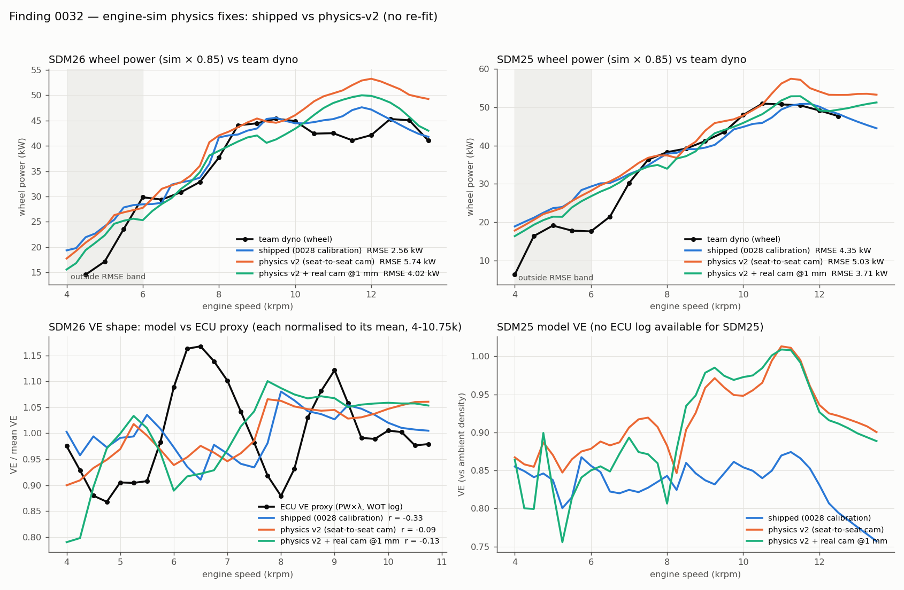

## TL;DR

| | SDM26 shipped | SDM26 v2 | SDM26 v2 + real cam | SDM25 shipped | SDM25 v2 | SDM25 v2 + real cam |
|---|---:|---:|---:|---:|---:|---:|
| WOT 6-13.5k RMSE / bias (kW) | **2.56** / +1.04 | 5.74 / +4.17 | 4.02 / +1.19 | 4.35 / +0.73 | 5.03 / +3.63 | **3.71** / +0.81 |
| peak 7-11.5k RMSE | 2.71 | 5.07 | 4.03 | 2.23 | 3.20 | 2.21 |
| high 10.5k+ RMSE | 3.34 | 8.30 | 5.30 | 2.39 | 5.08 | 1.85 |
| 6-8.5k RMSE | 2.08 | 2.65 | 2.49 | 6.08 | 5.91 | 5.33 |
| ECU VE-shape corr (4-10.75k) | -0.33 | -0.09 | -0.13 | n/a | n/a | n/a |
| model VE mean (ve_atm) | 0.85 | 0.93 | 0.90 | 0.83 | 0.92 | 0.90 |

Wheel = sim brake x 0.85 vs team Dynojet (`references/dyno/`), bands per 0021/0029.
ECU corr = Pearson r of mean-normalised model `ve_atm` vs the WOT ECU VE proxy
(injector PW x lambda, dead time 1.0 ms, 250 rpm bins) from the SDM26 log used
in the 0929 audit. **No knob was re-fit.**

VE extrema (parabolic-refined, 250 rpm grid):

| | peaks (rpm) | troughs (rpm) |
|---|---|---|
| ECU proxy (SDM26 car) | 5120, 6410, 8970, 10090 | 4680, 5180, 7980, 9650, 10600 |
| SDM26 dyno torque | 6050, 8580, 12460 | 7280, 11930 |
| SDM26 shipped | 4530, 5530, 6820, **8090**, 9330, 11630 | 4260, 4760, **6440**, 7410, 8940, 11220 |
| SDM26 v2 | 5300, 6530, 7870, 8890, 10650, 11630 | 6040, 7010, 8800, 9340, 11350 |
| SDM26 v2 + cam | 5270, 7830, 8760, 10000, 10380 | 6060, 8540, 9320, 10370 |

The dominant model trough still sits at ~6.0-6.4k exactly where the car has
its biggest VE peak (6.4k), and the model's big rise is at ~7.8-8.1k where the
car has its deepest trough (8.0k). v2 moves the upper structure toward the car
(peaks near 8.8-10.0k, trough near 8.5k) but not the main mode. **Conclusion:
the phase error is not explained by the boundary-condition physics fixed
here.** The remaining suspects are the unsourced intake geometry (runner
length / plenum volume and shape / restrictor-to-plenum neck, cf. the audit's
runner-length sweep, which moves the peaks ~1:1 with length) and the
single-point plenum topology (all runners on one node). Intake CAD is the
next input.



Visual inspection of the figure (owner's standing rule): SDM26 v2 over-reads
above 10k by up to 11 kW (shape regression at the top end); v2 + cam dips
at 9.25k (40.6 kW vs dyno ~45) and is also high above 10.5k. SDM25 v2 + cam
tracks the dyno better from 9k up but shows two sharp VE dips at 4.75k and
5.25k (0.80 / 0.76) that neither the shipped model nor the dyno has
(the dyno is untrusted below 6k). No curve is monotone-broken or noisy
above 6k.

## Fixes (all opt-in `physics` flags; `SDM26Config::default()` untouched)

Theory tests: `crates/cfd-core/tests/regressions_0032_audit_physics_fixes.rs`
plus unit tests in `engine-sim` (restrictor, valve, cylinder, loader).
Parity suite (python goldens, sweep fixture) green at every commit.

1. **Intake junction loss direction** - `intake_junction_directional_loss`,
   `intake_runner_entry_k` (default 0.04 bellmouth), per-runner
   `entry_loss_k` / `bellmouth_radius` (Crane TP-410 A-29 K(r/d)).
   The junction pressure is treated as the plenum STAGNATION pressure:
   plenum->runner face static = p_j - (1+K_in)q, runner->plenum =
   p_j - (1-K_bc)q with K_bc = (1-A_r/A_p)^2, applied at constant
   stagnation enthalpy. Steady-flow test (80 mm plenum pipe, 38 mm runner):
   measured dp0/q = **0.330 vs K_in 0.30** forward and **0.635 vs
   Borda-Carnot 0.600** on backflow. The legacy `BordaCarnot` mode measures
   **-0.354** forward (a spurious stagnation-pressure GAIN - equal static
   pressures hand the runner q for free, then only 0.6 q is taken back) and
   0.957 on backflow. Alone: SDM26 RMSE 2.56 -> **1.81**, SDM25 4.35 -> 4.42,
   ECU corr -0.33 -> -0.30.
   The CV ("stagnation") junction is unchanged (its "K = 1.0" argument is a
   volume factor; it is kept for parity and now labelled in the UI).
2. **Venturi restrictor** - `restrictor_venturi_model`,
   `restrictor_diffuser_efficiency` (optional). Throat pressure from the
   diffuser recovery p_pl - p_t = R(p0 - p_t), R = (1-s^2) - phi(alpha)(1-s)^2
   (Idelchik 5-2, 6 deg -> R = 0.878); inlet ghost conserves T0
   (T = T0 - u^2/2cp, closed form). Replaces - does not stack with - the
   legacy loss coefficient, Idelchik loss and Mach-Cd terms. Tests: choked
   ceiling **0.07516 kg/s** = isentropic (Cd 1, 293 K, 20 mm); choke onset now
   at **95.5 kPa** plenum (legacy 53.5 kPa); ghost T0 exact to 1e-9 K.
   Alone this is the dominant change: SDM26 WOT bias **+8.2 kW** (RMSE 9.65).
   The legacy model under-flows the restrictor at every rpm and the 0028
   calibration (and the 0.94 eta, Mach-Cd k, Idelchik loss) was fitted around
   that deficit. Without the venturi (v2 + cam, legacy restrictor) the model
   reads LOW instead (bias -5.0 / -4.3 kW), so the restrictor is now the
   single largest calibration question; a measured restrictor pressure
   (plenum MAP at WOT, 96 kPa in the ECU log at 4-5k) is the right anchor.
3. **Plenum** - `plenum.length` / `n_cells` / `wall_temperature` loadable
   (defaults 0.3 m / 20 / 320 K unchanged). *Stretch not done*: distinct
   runner attachment points and a finite restrictor-to-plenum neck pipe
   need a multi-junction plenum topology and touch the capture code's
   pipe-role assumptions; not clean in this pass.
4. **End corrections** - `intake_runner_end_correction` (flanged 0.85 r,
   per-runner `end_correction`), `exhaust_collector_end_correction`
   (Levine-Schwinger 0.6133 r). The shipped configs bake +0.6133 x
   DIAMETER (30.7 / 31.2 mm) into `exhaust_collector.length` - twice the
   physical correction; v2 stores the geometric 100 mm and sets the flag.
   Quarter-wave test (closed / pressure-release pipe): bare 1-D pipe
   L_ac = 0.24498 m for L = 0.245 (no intrinsic end correction), runner
   delta measured **16.13 mm vs 0.85 r = 16.15 mm**, collector **15.32 vs
   15.33 mm**.
5. **Physical exhaust open end** - `exhaust_collector_open_end_physical`:
   |R| = 1 - (ka)^2/2 at the firing frequency with the local sound speed
   (~0.99). Alone: RMSE 2.56 -> 2.85, ECU corr -0.33 -> -0.27. The fitted
   0.15 stays in the shipped configs.
6. **Composition-dependent pipe gamma/R - SKIPPED.** The pipe solver
   (MUSCL/HLLC/WENO, CFL, sources, every BC) takes one gamma per call; a
   Y-dependent gamma needs a variable-gamma Riemann solver and a
   contact-preserving (Abgrall-type) energy treatment to avoid spurious
   pressure oscillations at the burned/fresh interface. That is a
   solver-core change (spec section 2, SOLVER-CHANGE-REQUIRED) and needs an
   explicit owner decision. Expected effect: exhaust sound speed ~2-3 %
   lower (gamma 1.33 vs 1.40), shifting exhaust tuning ~2-3 % in rpm.
7. **Fuel / residuals** - `fuel_mass_from_trapped_air` (m_air/AFR; the
   legacy m/(1+AFR) under-fuels by 7 % because the pipes carry air only),
   `heat_release_o2_limited` (rich burns only m_air/AFR_stoich),
   `enable_residual_tracking` now loadable. Unit tests on the closed forms.
   Combined alone: bias -2.3 kW (net heat release at AFR 13.1 is 14.1/14.7 =
   0.96 of legacy). eta_comb 0.94 was left as is (no re-fit), although part
   of its 0028 "rich-AFR trim" is now modelled explicitly.
8. **App / config hygiene (shipped ON)** - loader warnings on unknown /
   misspelled / wrong-typed keys (Studies screen + log + helios-bench
   stderr), drivetrain fallback 0.91 -> 0.85, templates = shipped configs
   (vitest), optimization uses the sweep preset + 40/30 cycles, stagnation
   junction labelled "not for wave tuning", `[[sweep.grid]]` in
   helios-bench for runner-length studies (see below).

**Cam add-on** - `valve_events_at_reference_lift` (+ `valve_event_reference_lift`
1 mm, `valve_lift_shape_exponent` 1.3): events are read as 1 mm-lift points and a
C1 sin^n lobe is sized so L = 1 mm exactly there (seat-to-seat +34 deg IN /
+36 deg EX). Source: Honda CBR600RR 2007 (PC40) service manual p.10 - IN 21
BTDC / 44 ABDC, EX 40 BBDC / 5 ATDC at 1 mm. The config had IN 10 BTDC (IVO
~11 deg late, and read seat-to-seat). **The SDM25/26 engine year is
unconfirmed** (a 2003-06 PC37 could differ slightly). Peak lifts kept at
8.56 / 7.35 mm (8.3 / 7.2 from a secondary source is unverified). Alone on
the shipped config: SDM26 2.56 -> 2.61, SDM25 4.35 -> **3.93**, ECU corr
-0.33 -> -0.38. Inside v2 it helps both engines (v2 -> v2 + cam: SDM26
5.74 -> 4.02, SDM25 5.03 -> 3.71).

## Shipping decision

Rule: flip shipped configs only if v2 is clearly no worse on dyno RMSE AND
better or equal on ECU VE shape. v2 + cam is better on SDM25 (3.71 vs 4.35)
and slightly better on ECU shape (-0.13 vs -0.33, still ~uncorrelated), but
clearly worse on SDM26 (4.02 vs 2.56, high-band over-read). **Shipped
`sdm25.json` / `sdm26.json` are unchanged.** v2 + cam ships as
`sdm26-physics-v2.json` / `sdm25-physics-v2.json` (experimental examples).

Candidates for the next calibration round (owner decision, needs the intake
CAD first): the directional junction (fix 1) improves SDM26 by 0.75 kW and is
neutral on SDM25; the real cam improves SDM25 by 0.4 kW and is neutral on
SDM26. The venturi should only ship together with a restrictor/plenum
measurement, because it moves the whole top end.

## Runner-length studies

```toml
[[sweep.grid]]
name = "runner_length"
values = [0.18, 0.21, 0.245, 0.28, 0.32]
```

runs every rpm at every length (rows carry `overrides.runner_length`); the
variable-length envelope is `max over lengths` per rpm of `brake_torque_Nm`.
Until the phase error above is resolved, read such studies as RELATIVE
(length-to-length) - absolute peak rpm is not yet trustworthy.

## Reproducibility

```bash
cargo build --release -p helios-bench
OUT_DIR=/tmp/v2val python physics_findings/0032-audit-0929-physics-fixes/drive.py all
#  (then copy the per-variant rows into results/ as the analyzer expects)
python physics_findings/0032-audit-0929-physics-fixes/analyze.py
```

`results/*.ndjson` hold every trial row used above (30 cycles, 4000-13500 /
250 rpm, characteristic junction). The ECU proxy is `ecu_ve_proxy.csv`
(dead-time 1.0 ms rows). Nonconservation stayed below 3e-6 kg per cycle in
every run.

## Skeptic review

Not run (no skeptic agent in this pass). Items a skeptic should challenge:
the ECU proxy assumes constant injector dead time and fuel pressure; the
v2 "physical" collector reflection is evaluated at a single frequency; the
Idelchik phi assumes attached diffuser flow.
