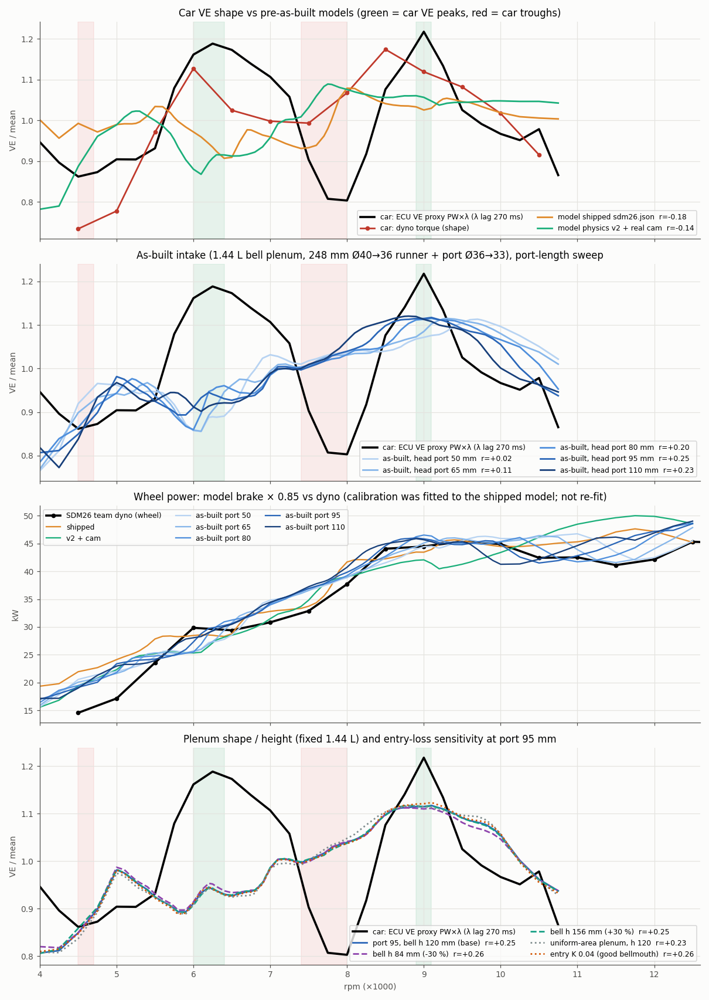

## TL;DR

| variant | ECU corr r (λ lag 270 / 120 ms) | model VE peaks (rpm) | model VE troughs (rpm) | dyno RMSE / bias 6-12.5k (kW) | RMSE 6-8.5k | RMSE 7-11.5k | RMSE 10.5-12.5k | plenum p 4-5k / 10k (kPa) | ΔMAP 6-8k / 10k vs 4-5k (kPa) |
|---|---|---|---|---|---|---|---|---|---|
| **car** | - | 5120, **6280**, **8990**, 10420 | 4560, 5130, **7880**, 10220 | - | - | - | - | MAP 96.0 / 88.9 (baro unknown) | **-2.5 / -7.1** |
| shipped `sdm26.json` | -0.18 / -0.33 | 4530, 5530, 6820, 8090, 9330, 11630 | 4260, 4760, 6440, 7410, 8940, 11220 | 2.69 / +1.26 | 2.08 | 2.71 | 3.85 | 98.2 / 82.1 | -4.4 / -16.2 |
| v2 + cam (0032) | -0.14 / -0.11 | 5270, 7830, 8760, 10000, 10380 | 6060, 8540, 9320, 10370 | 4.26 / +1.18 | 2.49 | 4.03 | 6.20 | 101.5 / 96.2 | -1.2 / -5.3 |
| as-built, port 50 mm | +0.02 / +0.07 | 4860, 5390, 7060, 8340, 9700 | 5350, 6040, 7350, 8390, 12010 | 2.60 / +0.92 | 3.09 | 2.73 | 2.70 | 101.4 / 95.3 | -1.0 / -6.1 |
| as-built, port 65 mm | +0.11 / +0.15 | 5400, 7370, 9350 | 6000, 7380, 11760 | **2.34** / +1.11 | 2.82 | 2.18 | 2.37 | 101.3 / 94.7 | -0.9 / -6.6 |
| **as-built, port 80 mm (shipped example)** | +0.20 / +0.20 | 5240, 6410, 9110 | 5940, 6670, 11650 | 2.59 / +1.24 | 2.96 | **2.05** | 2.71 | 101.4 / 94.9 | -1.0 / -6.5 |
| as-built, port 95 mm | **+0.25** / +0.21 | 5070, 6300, 8960, 11900 | 5800, 6520, 11600, 12250 | 2.62 / +1.51 | 2.61 | 2.28 | 3.25 | 101.5 / 95.8 | -1.2 / -5.7 |
| as-built, port 110 mm | +0.23 / +0.17 | 5010, 5720, 8780 | 4230, 5470, 6090, 11820 | 3.02 / +1.72 | 2.78 | 2.94 | 3.64 | 101.5 / 97.4 | -1.3 / -4.1 |
| port 95, bell h 84 mm (-30 %) | +0.26 / +0.22 | 5070, 6290, 7330, 8840 | 4140, 5810, 6570, 7410 | 2.08 / +0.40 | 2.28 | 1.98 | 2.16 | 101.3 / 94.0 | -1.4 / -7.3 |
| port 95, bell h 156 mm (+30 %) | +0.25 / +0.21 | 5060, 6300, 7380, 8850, 12000 | 5820, 6530, 11670, 12240 | 2.59 / +1.45 | 2.64 | 2.26 | 3.14 | 101.4 / 95.6 | -1.2 / -5.9 |
| port 95, uniform-area plenum | +0.23 / +0.20 | 5060, 6290, 8860, 12080 | 4130, 5800, 6570, 11690, 12160 | 2.52 / +1.39 | 2.58 | 2.19 | 3.07 | 101.1 / 95.9 | -1.3 / -5.1 |
| port 95, entry K 0.04 | +0.26 / +0.22 | 5070, 6290, 7370, 8970, 11840 | 5780, 6530, 7380, 11540, 12250 | 2.72 / +1.62 | 2.62 | 2.37 | 3.45 | 101.5 / 95.5 | -1.2 / -5.9 |

- ECU corr = Pearson r of mean-normalised model delivered VE (`ve_atm`) vs the
  WOT ECU VE proxy (injector PW x λ, dead time 1.0 ms, **λ shifted 270 ms**,
  250 rpm bins, 4000-10750 rpm; audit `hunt/proxy.py`), copy in
  `ecu_ve_proxy_lag270.csv`. The 120 ms column is the lag sensitivity.
- Extrema: parabolic-refined on the 250 rpm grid. Sweeps: 4000-12500 / 250 rpm
  plus 100 rpm steps 5000-10000, 30 cycles, characteristic junction.
- Dyno: wheel = model brake x 0.85 vs team Dynojet (`references/dyno/sdm26-team-dyno.csv`,
  500 rpm points). **The shipped calibration (eta 0.94, fmep, spark slope, ...) was
  fit to the legacy model; nothing was re-fit here.** Band ends at 12.5k (0032
  used 13.5k, so the shipped 2.69 here vs 2.56 there).
- Plenum pressure: time- and cell-averaged plenum static pressure, p_ambient
  101.325 kPa. The ECU log has no baro channel, so compare the **drop from the
  4-5k level** (ΔMAP): car -2.5 kPa at 6-8k and -7.1 kPa at 9.5-10.5k.

## Verdict

**Partly.** The as-built geometry moves the model's upper mode onto the car:
VE peak at 8.8-9.1k (car proxy 9.0k, dyno torque 8.6k), a fall-off after 9.5k,
and the dyno's 10.5-11.5k power dip (41-42 kW) appears for ports of 80-110 mm.
It also gets the WOT plenum depression right. The shipped model over-drops by
16 kPa at 10k. As-built drops 5.7-6.6 kPa against the car's 7.1. With no re-fit,
it matches the dyno as well as the calibrated shipped model (2.3-2.6 vs 2.69 kW
at 6-12.5k) and is clearly better at the top end (2.4-3.3 vs 3.85 kW at
10.5-12.5k).

It does **not** fix the dominant mid-band mode. The car's biggest VE feature is a
+20 % hump at 6.0-7.2k followed by a -20 % trough at 7.4-8.0k (dyno torque:
peak 6.05k, dip 7.3k). Every as-built variant has a local dip near 5.8-6.0k,
only a small bump near 6.3k, and rises steadily through 7.4-8.0k. There, the
model over-reads the dyno by 2-4 kW. So r stays weakly positive (+0.25) rather than
strongly positive. The 6-8.5k dyno band is slightly worse than shipped
(2.6-3.1 vs 2.08).

## Port length (a geometry estimate, not a free knob)

The port is the only unmeasured intake length. Across the physically
plausible range of 50-110 mm, r rises from +0.02 (50) to +0.11 (65), then stays
at +0.20 to +0.25 for 80-110. The best is **95 mm (r +0.25)**, but 80, 95 and 110 are
indistinguishable given proxy noise (λ lag 120 vs 270 ms moves r by up to
0.06). Dyno RMSE favours 65-80 mm (best 7-11.5k band at 80). The committed
example therefore keeps the a-priori **80 mm** estimate rather than the
best-correlation value. The conclusion does not depend on the port: no length
in 50-110 mm produces the car's 7.4-8.0k trough. The mid-band shape (dip ~5.9k,
monotone 7-9k) is almost unchanged across ports. Only the upper peak
position moves (9.35k at 65 mm down to 8.78k at 110 mm, ~ -12 rpm/mm).

Plenum height ±30 % at fixed volume, a uniform-area plenum of the same
volume, and the entry loss (K 0.2 vs 0.04) each move r by ≤ 0.02 (panel 4).
The plenum's own shape is irrelevant to the phase. h 84 mm (an almost
cylindrical bell) reads ~1.1 kW lower across the band because its plenum
pressure is ~1.8 kPa lower at 10k. That lowers dyno RMSE (2.08), but it is a
level effect, not a phase effect.

## What remains unexplained

1. The 6-8k mode (car peak 6.3k / trough 7.9k). Intake geometry is now
   as-built except for the port, and plausible ports don't produce it. The
   remaining candidates, in order:
   - Exhaust geometry. It is still the unsourced config: primaries 308 mm,
     secondaries 392 mm, collector 100 mm. The audit hunt found exhaust lengths
     move r by more than 0.5 (`hunt/summary.csv`, best primary 0.45 / secondary
     0.30 m r +0.44 on v2), so measuring the header is the next input.
   - Wave interaction between runners through the shared single-node plenum.
     The runners actually cluster near the axis, so this is probably OK.
   - The ECU proxy itself: constant dead time and fuel pressure assumed, and
     λ lag. The dyno shows the same 6k peak / 7.3k dip at smaller amplitude,
     so the feature is real.
2. Absolute level below 6k. The model reads 2-5 kW above the dyno at 4-5.5k,
   where the dyno is untrusted (0032).

## Model support added (opt-in, no effect on existing configs)

- `plenum.diameter_profile` `[[x, d], ...]`: a shaped plenum pipe. x is
  measured from the restrictor end. The profile's end x and its integrated
  volume replace `length` / `volume`, with a warning if the scalars disagree.
- `intake_pipes[i].diameter_profile`: a piecewise-linear runner, used here
  to model runner + head port as one pipe. It is stretched to `length`. With
  `intake_runner_end_correction` the correction extends the pipe at the mouth
  with the mouth diameter.
- `restrictor.outlet_diameter`: the diffuser exit for the venturi area ratio
  σ. Before, σ always used the plenum cross-section `volume / length`.
- Tests: `config::loader::tests::diameter_profiles_and_restrictor_outlet_load_and_build`
  checks the cell areas against the profile, the cone volume, σ and the
  end-correction shift. `bad_diameter_profiles_are_schema_errors` covers bad
  input. The new config is in the warning-free and engine-validation config
  lists.

## Modelling choices and limits (as-built config)

- Runner: 235.4 mm body + 12.7 mm bellmouth = 248.1 mm, Ø40 -> Ø36 at the
  flange. Port: 80 mm, Ø36 -> Ø33. The Ø33 is a single pipe with the area of
  two ~23.4 mm (0.85 x 27.5 mm) valve throats. The mouth end correction is the
  flanged default (0.85 r = 17 mm). A protruding bellmouth is closer to the
  unflanged 0.61 r, a 5 mm difference. The bellmouth entry is K 0.2 with the
  0032 directional junction.
- Not modelled: S-bend loss, 3-D-print roughness (the friction model ignores
  roughness), and the injector position.
- Plenum: a 1.44 L bell, d(t) = 38 + 129 (1 - (1-t)^n) mm. The estimated
  height is 120 mm, which gives n = 1.61. The restrictor is at x = 0 and all
  runners are on the far end node.
- Restrictor: 0032 venturi BC. Throat 20 mm, Cd 0.95, diverging 3.2°, outlet
  38 mm, so σ = 0.277 and R = 0.871. The 228 mm length is not resolved, because
  the BC is quasi-steady with no neck inertance. Its Helmholtz mode with the
  plenum is ~75 Hz, below the induction frequency above 4k rpm.
- The 1-D bell recovers the Ø38 jet's dynamic head isentropically, up to
  ~2 kPa at choke, which a real jet into a dome mostly loses. The
  uniform-area-plenum variant brackets this.
- The 32 mm butterfly is not modelled (<1 % flow at WOT).
- Cam: service manual at 1 mm (0032 `valve_events_at_reference_lift`).
  Exhaust and all other physics-v2 settings are unchanged.

## Reproducibility

`gen_configs.py` writes the variants. `drive.py` runs `huntexp` (the audit's
scratch driver over `SDM26Engine`, source `huntexp_main.rs`) per rpm.
`analyze.py` / `plot.py` read the ECU log from the audit scratch (`hunt/log.pkl`,
not in repo). All model rows are in `model_rows.csv` and the table is
`summary.csv`.
