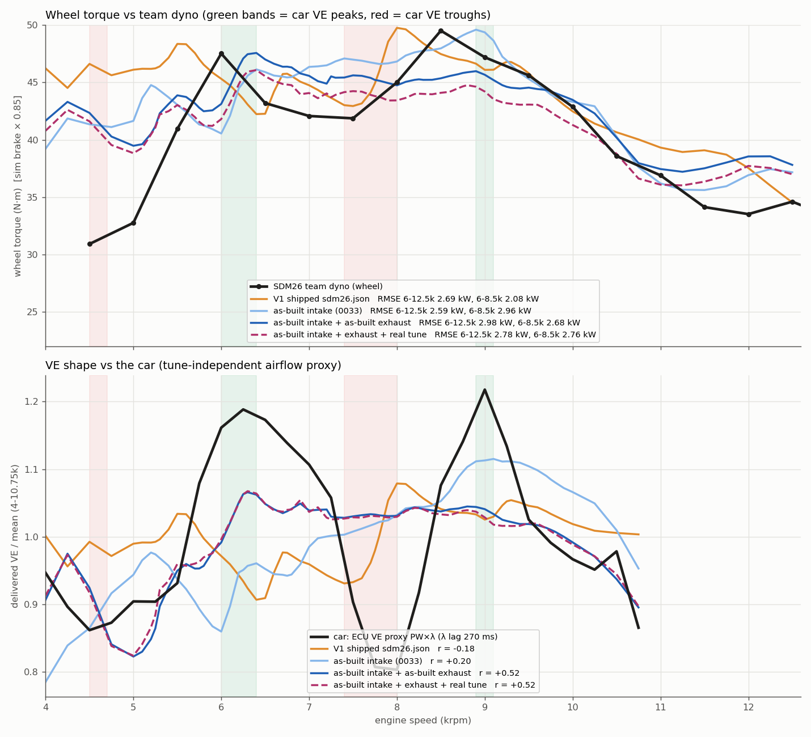

## TL;DR

| variant | ECU r (λ lag 270 / 120 ms) | VE peak 5.5-7k / min 7-8.5k / peak 8.5-10k (rpm) | trough depth* (car -0.40) | dyno RMSE / bias 6-12.5k (kW) | 6-8.5k | 7-11.5k | 10.5-12.5k | dyno torque r 4.5-12.5k |
|---|---|---|---|---|---|---|---|---|
| **car** (ECU proxy / dyno) | - | 6280 / 7880 / 8990 (dyno T 6050 / 7280 / 8580) | -0.40 | - | - | - | - | - |
| (a) V1 shipped `sdm26.json` | -0.18 / -0.33 | 5500 / 7400 / 9300 | - | 2.69 / +1.26 | **2.08** | 2.71 | 3.85 | 0.51 |
| (b) as-built intake (0033) | +0.20 / +0.20 | 7000 / 7000 / 9100 | -0.04 | 2.59 / +1.25 | 2.96 | 2.05 | 2.71 | 0.74 |
| **(c) + as-built exhaust (committed `sdm26_asbuilt_exhaust`)** | **+0.52 / +0.60** | **6300** / (flat) / 8800 | -0.03 | 2.98 / +1.18 | 2.68 | 2.29 | 3.94 | **0.76** |
| (e) (c) + real tune (`sdm26_asbuilt_realtune`) | +0.52 / +0.60 | 6300 / (flat) / 8800 | -0.03 | 2.78 / **-0.10** | 2.76 | 2.36 | 3.02 | 0.72 |
| (b) + real tune (reference) | +0.19 / +0.20 | 7000 / 7000 / 9000 | - | **2.37** / -0.08 | 2.81 | **1.85** | **2.13** | 0.69 |

\* depth = normalised VE minimum in 7.3-8.2k minus the mean of the 6.0-6.6k and 8.6-9.4k maxima.

Sweeps around (c) (d):

| sweep (one change from (c)) | ECU r 270 / 120 | depth | RMSE 6-12.5k | 6-8.5k | 10.5-12.5k |
|---|---|---|---|---|---|
| step+elbow 200 / 250 / **300** / 350 / 400 mm (12 in muffler) | 0.60 / 0.55 / **0.52** / 0.49 / 0.50 (120 ms: 0.60-0.65) | -0.06 / -0.04 / -0.03 / -0.02 / -0.02 | 2.86 / 2.99 / 2.98 / 2.92 / 3.15 | 2.55-2.77 | 3.65-4.17 |
| 17 in muffler at 200 / 300 / 400 mm | 0.52 / 0.49 / 0.53 | -0.03 / -0.02 / -0.02 | 3.00 / 3.21 / 3.38 | 2.73-2.74 | 3.89-4.66 |
| head port 40 / 50 / **65** / 80 / 90 mm | 0.49 / 0.51 / **0.52** / 0.55 / 0.56 | -0.05 / -0.04 / -0.03 / -0.04 / -0.04 | 2.84 / 2.85 / 2.98 / 3.08 / 3.25 | 2.69-2.77 | 3.63-4.39 |
| secondary reading C (254.7 mm tube) / **A (361.0)** / B (467.3) | 0.57 / **0.52** / 0.49 | -0.07 / -0.03 / -0.03 | 2.89 / 2.98 / 3.27 | 2.59-2.68 | 3.84-4.51 |
| pairing 1&2 / 3&4 (180° pairs, NOT the stated layout) | 0.60 / 0.68 | -0.10 | 4.36 | 2.39 | 6.36 |

- ECU r: Pearson r of mean-normalised delivered VE (`ve_atm`) vs the WOT ECU VE proxy
  (injector PW x λ, dead time 1.0 ms, 250 rpm bins, 4000-10750 rpm; audit `hunt/proxy.py`,
  same as 0033). Dyno: wheel = model brake x 0.85 vs `references/dyno/sdm26-team-dyno.csv`.
  Runs: 4000-12500 / 250 rpm plus 100 rpm steps 5000-10000, 30 cycles, characteristic
  junction, 0033 `huntexp` driver. **No calibration knob was re-fit.**

Sensitivity panels: `fig_sens.png`.

## Verdict on the 6-8k band

**Half fixed.** Every as-built exhaust variant puts a VE peak at 6.31-6.34k, where the car's
proxy peaks (6.28k) and the dyno torque peaks (6.05k). The as-built intake alone had a dip
there. This feature does not depend on the unmeasured lengths: below 7k all the
downstream-length variants overlay each other. So it comes from the measured primaries,
collectors and secondaries. The low-rpm trough also moves toward the car (model ~5.0k vs car 4.6k).
Together these raise ECU r from +0.20 to +0.52. The 6-8.5k dyno RMSE improves from 2.96 to 2.68 kW,
but is still worse than the calibrated V1 (2.08).

**The trough is still missing.** From 6.6k to 9.0k the model VE is flat within ±2 %
(range 0.02-0.04 in every 360°-pair variant). The car's proxy falls 20 % into 7.4-8.0k and the dyno falls
12 % (47.5 → 42 N·m) at 6.5-7.5k. The model over-reads the dyno there by 3.5-3.8 N·m (wheel). It also
**regresses the upper mode.** The as-built intake's 9.1k VE peak (+13 %) shrinks to +6 %
at 8.8k, and wheel torque at 8.5k is now 4.1 N·m under the dyno's 49.5 N·m peak (intake-only: -1.5). At
11.5-12.5k the model reads 3.2-5.0 N·m high (intake-only 1.5-3.4; RMSE 3.9 vs 2.7 kW). By the owner's
rule (a shape regression fails even when RMSE improves), (c) is a better *phase* model below 7k,
but it is **not** a better model overall than (b). The committed config is marked
experimental with that caveat.

## Unmeasured lengths: best estimates and sensitivity

- **Muffler 12 in vs 17 in:** r 0.52 vs 0.49 at 300 mm, 0.60 vs 0.52 at 200 mm, 0.50 vs 0.53
  at 400 mm. The sign is not consistent, and the shape difference sits above 7k at the ±2 %
  level. **Insensitive, so the committed default is 12 in.** The 17 in muffler is slightly worse
  on the dyno above 10.5k (+0.2-0.5 kW RMSE).
- **Step/elbow section (CAD estimate 250-400 mm, baseline 300):** r falls gently from 0.60
  (200) to 0.50 (400). The best value is at the short end of the range. It is not a trough fix:
  depth goes from -0.06 at best to -0.02. Kept at the a-priori 300 mm.
- **Head port:** r rises from 0.49 (40 mm) to 0.56 (90 mm). The dyno prefers short ports (2.84 vs
  3.25 kW). Kept at the a-priori 65 mm.
- **Secondary reading:** A (tube 361.0 mm, junction-to-junction 467.3 mm, the literal
  reading) is committed. C (467.3 mm measured from the first collector's *start*) has r 0.57 and
  restores more of the 9k peak (depth -0.07). B (467.3 mm tube) is worst. None makes the trough.
- **Primary ID:** the owner confirmed OD sizes, so the ID 31.75 mm case was dropped (not run).
- **Pairing (unconfirmed from the CAD):** relabelling to 180° pairs (1&2, 3&4) is the only
  change that produces a real 7.4-8.2k sag (VE 0.985 vs peaks 1.085 / 1.10 at 6.3k / 9.1k,
  depth -0.10, r +0.60 / +0.68). It also matches the dyno best at 6-8.5k (2.39 kW). But it
  over-reads 10.5-12.5k by 6 kW (RMSE 6.36) and holds torque flat to 10.2k. It is not
  committed. **Which primaries share a collector is the most useful single measurement left.**

Across all 14 physically plausible 360°-pair variants, r = 0.49-0.60 and the trough
depth is -0.02 to -0.07 against the car's -0.40. The conclusion does not depend on the
estimates.

## Real tune (e)

`tune.py` takes per-250-rpm WOT medians from the decoded ECU log (the same filter as the proxy,
λ shifted 270 ms). Ignition rises from 20.5° at 4k through 27.7° at 6k and 30.3° at 8k to 36.0° at 10k,
against the model's slope tune of 19° / 22° / 25°. λ is very uneven: 0.70 at 4.5-5.5k, 0.94-1.00
at 6.25-7.25k, 0.74-0.81 at 7.75-8.75k and 0.86-0.92 above 9k (target 0.88 throughout). The logged
pulls end at 10.75k, so the maps hold their last values above that. Physics: `spark_advance_map` +
new `afr_map`, O2-limited heat release on, `afr_eta_enabled` off.

The effect is a level change, not a shape change. Bias goes from +1.18 to -0.10 kW and the 10.5-12.5k
RMSE from 3.94 to 3.02. The 6-8.5k RMSE gets slightly worse (2.68 → 2.76) and dyno-torque r drops from
0.76 to 0.72. The advance and rich λ cut the 6.5-7.5k over-read from 3.5-3.8 to 2.0-2.4 N·m, in the
direction of the dyno dip, but they also deepen the 8.5k under-read (-4.1 → -5.4 N·m), so the tune does not make the dip. VE is unchanged (r 0.52). The same tune on the
intake-only model gives the best dyno numbers of the whole study (2.37 kW, 7-11.5k 1.85, 10.5-12.5k
2.13).

## What is still unexplained

1. **The 7.4-8.0k trough (and the full 9k amplitude).** With intake and exhaust now as-built,
   within stated ranges, the 1-D model has no deep mid-band minimum unless the pairing differs.
   Candidates, in order:
   (i) Pairing and the actual Tri-Y routing. Owner to confirm from the header, since the effect is large.
   (ii) Junction physics: the collectors are modelled as lossless point junctions at the merge.
   The real 2-1 has 46.6 mm of side-by-side pipe (the pipes interact before they merge) and a converging cone.
   `exhaust_junction_borda_carnot` / loss K were not swept, because they are calibration knobs.
   (iii) Bend losses in the U-bends and elbow, and the perforated-muffler loss (not modelled).
   (iv) The ECU proxy itself. The dyno's dip is at 6.5-7.5k with -12 % amplitude, while the proxy's
   is at 7.4-8.0k with -20 %. The λ excursion over 7.75-8.75k (0.75) lines up with the proxy trough, so
   part of the proxy trough may be lag or transient fuelling rather than airflow.
2. **Top end 10.5-12.5k.** The exhaust versions read 3-5 N·m above the dyno at 11.5-12.5k (the intake-only model 1.5-3.4). Only
   the calibration (fmep, eta) or tune addresses this, and neither was re-fit.

## Model support added (opt-in, parity kept)

- `exhaust_primaries[i].diameter_profile`, `exhaust_secondaries[i].diameter_profile`,
  `exhaust_collector.diameter_profile`: piecewise-linear `[[x, d], ...]`. x runs downstream from
  the valve or merge, and the profile is stretched to `length` (with a warning if they disagree), the same contract
  as the 0033 runner profile. With `exhaust_collector_end_correction` the 0.6133 r correction
  (r from the profile's outlet) extends the tail at the outlet with the outlet diameter. The
  profile is not stretched over it. The spec functions report the profile end diameters.
- `physics.afr_map` `[[rpm, AFR], ...]`, sorted, AFR > 1. `WiebeParams::afr_at(rpm)` replaces
  `afr_target` for the IVC fuel mass (all four code paths) and for the optional AFR efficiency
  factor. The map parser is shared with `spark_advance_map` (`opt_rpm_map`).
- Without these keys every pipe and the fuel path are unchanged. `sdm26_asbuilt.json` at 7k
  reproduces 0033 exactly (VE 0.94140, 54.526 N·m).
- Tests: `exhaust_diameter_profiles_load_and_build` (cell areas, step positions, end correction
  at the outlet), `exhaust_profiles_absent_keep_legacy_pipes`,
  `afr_map_loads_interpolates_and_validates`, and bad exhaust profiles added to
  `bad_diameter_profiles_are_schema_errors`. The two new configs are in the warning-free and
  engine-validation lists.
- Limitation: `cfd-core` parameter overrides of exhaust *diameters* do not change a profiled pipe
  (the profile wins). Length overrides stretch it. This is the same as the 0033 runners.

## Geometry as modelled (committed `sdm26_asbuilt_exhaust.json`)

Walls are 0.049 in: 1.25 / 1.5 / 1.75 / 2.0 in OD → ID 29.26 / 35.61 / 41.96 / 48.31 mm.

- Primary (×4, 423.9 mm, 47 cells). It starts with a 65 mm port (27.65 mm → 29.26 mm; 27.65 mm is two 0.85 × 23 mm
  throats treated as one pipe). Then 302.3 mm of 29.26 mm tube, a 10 mm step to 35.61 mm at the collector entry, and
  46.6 mm side-by-side in the collector at 35.61 mm. The junction is at the merge.
- Secondary (×2, 467.3 mm): a 59.7 mm merged cone from 50.36 mm (2 × A_1.5in) to 35.61 mm, then 361.0 + 46.6 mm at 35.61 mm.
- Collector/tail (664.7 mm + 14.8 mm end correction): the same 59.7 mm cone, then 100 mm at 41.96 mm,
  200 mm at 48.31 mm (the straight run, V-band and elbow along the centreline), and a 305 mm muffler at 48.31 mm. The open end uses the 0032
  physical reflection.
- Wall temperatures are unchanged from 0033 (primaries 650 K, secondaries 550 K, collector 500 K).
  Pairing is 1&4 / 2&3 (360°, firing 1-2-4-3).

## Reproducibility

`tune.py` → `tune_wot.csv` (needs the audit `hunt/log.pkl`, not in the repo). `gen.py` writes the
variants and, with `--tune '{}'`, the real-tune variants. `drive.py` / `drive_pair.py` run the 0033
`huntexp` driver (`../0033-*/huntexp_main.rs`, pairing via `firing=1-4-2-3`). `analyze.py` →
`summary.csv`, `plot.py` → `fig_exhaust.png` + `chart_rows.csv`, and `sens.py` → `fig_sens.png`.
All model rows are in `model_rows.csv`.
