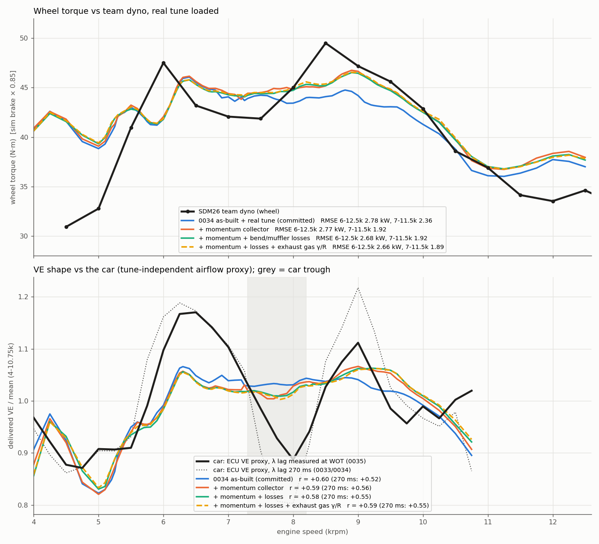
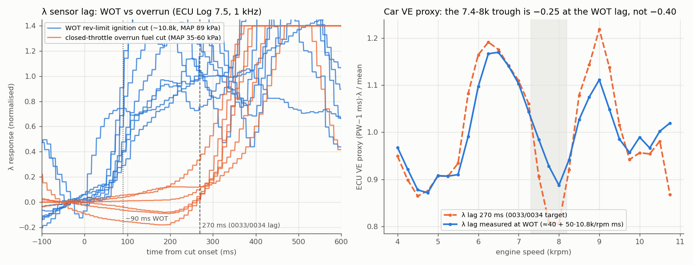

## TL;DR

- **The collector model helps, but it does not make the trough.** With the momentum merge
  junction, dyno-torque shape r goes from 0.70 to 0.79, ECU VE-shape r (270 ms) from 0.52 to
  0.56, and the 9k VE peak comes back at 9.0k (car: 9.0k). The model's 7-8k minimum deepens
  from −0.03 to −0.06 and moves to 7.7k (car: 7.9-8.0k), against the car's −0.25.
- **Best dyno fit so far:** real tune + momentum collector + bend/muffler losses + exhaust γ/R.
  - RMSE 6-12.5k: 2.66 kW (was 2.78).
  - RMSE 7-11.5k: 1.89 kW (was 2.36).
  - RMSE 6-8.5k: 2.42 kW (was 2.77).
  - The cost is at the top end: 10.5-12.5k RMSE goes from 3.02 to 3.54 kW, and the bias from −0.1 to +0.8 kW.
  - No calibration knob was re-fit.
- **The bend/muffler losses and exhaust γ/R are small, correct effects,** and neither is a trough mechanism.
  - The merge angle (0-20°) does not matter, so it is not a hidden fit knob.
- **The 0033/0034 λ lag was the closed-throttle value.**
  - Overrun fuel cuts respond in 230-320 ms.
  - WOT ignition cuts respond in a median of 90 ms (50 %), with onset at 62-88 ms.
  - The proxy at the WOT lag (committed as `references/ecu/proxy_wotA.csv`) keeps a real trough, but it is −0.25 deep, not −0.40.
- **Reframe:** the car's VE ripple and the dyno torque ripple agree (both 8.7 % std, 5.5-10k / 6-11k).
  - The model's VE ripple is 3.0-3.4 %, and the in-phase part (the slope of model on car) is only 0.16.
  - So the model has roughly the right phase and about 1/6 of the in-phase amplitude everywhere in 6-10k.
  - The next question is what damps the waves or under-drives them, not what makes a single trough.

## 1. The λ lag (handoff step 3: is the proxy trough an artefact?)

The raw `Log 7.5.csv` (the vault copy, sha256 `15cbbf7c…`, 1 kHz) was used for two step-response measurements:

| event | n | conditions | λ onset | λ 50 % |
|---|---|---|---|---|
| overrun fuel cut (100 %) | 6 | closed throttle, 4.7-8.2k, MAP 35-61 kPa | 233-317 ms | 262-743 ms (lean excursion to λ 5-8) |
| WOT rev-limit ignition cut (≥ 400 ms) | 8 | APS 97 %, 10.8k, MAP 89 kPa | 62-88 ms | median **90 ms** (28-118) |

The 270 ms lag used in 0033/0034 matches the closed-throttle cases, where the exhaust flow is 5-10× lower and
the gas is cold. At WOT the transport delay is a fraction of that. The WOT lag model
`lag = 40 + 50·(10 800 / rpm)` ms brackets it (with `90·10 800/rpm` as the all-transport bound). It gives
100-150 ms over 6-9k.

| proxy λ lag | 6.25k peak | 7.75k | 8.0k | 9.0k peak | trough depth* |
|---|---|---|---|---|---|
| 270 ms (0033/0034) | 1.192 | 0.810 | 0.805 | 1.219 | **−0.40** |
| 120 ms | 1.165 | 0.920 | 0.881 | 1.124 | −0.27 |
| 90 ms | 1.159 | 0.945 | 0.898 | 1.110 | −0.24 |
| WOT model A (40 + 50·10.8k/rpm) | 1.167 | 0.928 | 0.887 | 1.112 | **−0.25** |
| WOT model B (90·10.8k/rpm) | 1.173 | 0.913 | 0.880 | 1.116 | −0.26 |

\* The normalised minimum in 7.25-8.25k, minus the mean of the 6.0-6.75k and 8.5-9.5k maxima.

**Verdict:** about a third of the 270 ms trough was lag artefact. The rest is robust to any physically
plausible WOT lag (−0.24 to −0.27), so the car does have a real ~20 % airflow dip at 7.75-8k in PW·λ.
The 270 ms proxy also exaggerated the 9k peak (1.22 vs 1.11).

**The dyno disagrees on where the dip is, not on how big it is.** Dyno torque (raw `SDM.CSV`, 25 rpm bins) peaks at 6.0k,
sits flat at ~42 N·m over 6.5-7.75k, and peaks at 8.5-8.75k. Each dyno feature is 4-10 % lower in rpm than the
matching ECU feature (6.0/6.3k, 7.25/8.0k, 8.6/9.0k). The dyno rpm channel is `ERpmM`, and its README says
torque is binned at wheel-implied rpm. The team should confirm how the dyno derives engine rpm before the dyno's
feature positions are used for tuning decisions. Its ripple amplitude (8.7 % std, 6-11k) matches the
proxy's (8.7 %, 5.5-10k).

## 2. Momentum-mixing merge junction (handoff step 1)

The 0034 geometry already models the 46.6 mm side-by-side section as pipe, so the missing piece was the merge
itself. The characteristic junction holds every leg at one static pressure. That is lossless for acoustics, but it
over-dissipates an expansion (0.375 q instead of Borda-Carnot 0.25 q for A → 2A) and creates energy on a
contraction (0032). Most importantly, it puts an idle partner primary at the outlet's pressure.

`LossMode::Momentum` (`physics.exhaust_junction_momentum`) replaces that rule with the following:
- The merge is a mixing region at p_j. Each supplying leg discharges into it as a free jet, so its face sits at p_j.
- The jets mix into one stream with the mass-weighted velocity vector V and density ρ_m. Leg directions come from
  `physics.exhaust_merge_angle_deg`: the inlets sit at ±θ about the outlet axis.
- Each receiving leg draws from that stream with the generalised Borda-Carnot loss:
  `p_r + ½ρ_r w² = p_j + ½ρ_m(|V|² − L)`
  - Along the leg, L = |V⊥|² + min(0, w − V∥)². The cross-flow is lost, a deceleration costs (V∥ − w)², and an acceleration is lossless.
  - If V∥ < 0 (the flow must reverse), L = |V|².
- Every Δp is O(u²), so small-amplitude acoustics are identical to the old junction.
- Each leg reaches its own face pressure along its own characteristic. For junction → pipe legs, the velocity comes
  from the pipe interior and the entropy from the mixture. (The legacy entropy-pass reference mixes the mixture
  pressure with the interior velocity, which left a standing jump at the face once p_face ≠ p_mix. That was the
  first-draft bug the steady-state tests caught.)
- A Picard loop on the offsets is warm-started from the previous step; its contraction factor is about the face Mach number.

Theory regressions (`cfd-core/tests/regressions_0035_collector_momentum_junction.rs`), each driven to steady state:

| case | closed form | simulated |
|---|---|---|
| sudden expansion A → 2A, Δp0/q1 | 0.25 (incompressible) | 0.294 at M 0.36 |
| contraction 2A → A, Δp0/q2 | 0, never < 0 | −0.015 |
| 2-1 at 10°, partner primary dead: (p_out − p_idle)/q1 | cos θ − ½ = 0.485 | 0.478 (legacy junction: 0.000) |
| symmetric equal 0° merge, Δp0/q | 0 | 0.000 |
| lumped K = 0.8 in a straight pipe, Δp0/q | 0.8 | 0.833 |

### Engine results (sdm26_asbuilt_exhaust, 75 rpm points, 30 cycles, characteristic junction, nothing re-fit)

| variant | ECU r 270 / 120 / **WOT** | dyno T r | VE pk / tr / pk (rpm) | depth | RMSE 6-12.5 | 6-8.5 | 7-11.5 | 10.5-12.5 | bias |
|---|---|---|---|---|---|---|---|---|---|
| car | - | - | 6.3k / 8.0k / 9.0k (WOT lag) | −0.25 | | | | | |
| AB_ex (0034, committed) | 0.52 / 0.60 / 0.60 | 0.70 | 6300 / 7400 / 8800 | −0.03 | 2.98 | 2.68 | 2.29 | 3.94 | +1.18 |
| + momentum θ 0° / 10° / 20° | 0.56 / 0.61 / 0.59 | 0.79 | 6300 / 7700 / 9000 | −0.06 | 3.44-3.47 | 2.59-2.62 | 2.57-2.62 | 4.91-4.94 | +2.1 |
| + losses (LL1) | 0.53 / 0.61 / 0.60 | 0.75 | 6300 / 7600 / 8900 | −0.03 | 2.92 | 2.58 | 2.24 | 3.94 | +1.36 |
| + losses ×2 (LL2) | 0.52 / 0.60 / 0.58 | 0.75 | 6300 / 7900 / 8900 | −0.03 | 2.83 | 2.50 | 2.22 | 3.81 | +1.33 |
| + exhaust γ 1.30 / R 295 (G130) | 0.54 / 0.61 / 0.61 | 0.70 | 6300 / 7900 / 8800 | −0.03 | 3.09 | 2.72 | 2.37 | 4.13 | +1.31 |
| momentum + losses + γ (M_LL1_G130) | 0.55 / 0.61 / 0.59 | 0.79 | 6300 / 7800 / 9300 | −0.06 | 3.32 | 2.52 | 2.59 | 4.71 | +2.11 |
| **real tune:** RT (0034 `sdm26_asbuilt_realtune`) | 0.52 / 0.60 / 0.60 | 0.65 | 6300 / 7250 / 8800 | −0.03 | 2.78 | 2.77 | 2.36 | 3.02 | −0.10 |
| RT + momentum | **0.58 / 0.63 / 0.61** | 0.75 | 6300 / 7600 / 8900 | −0.06 | 2.77 | 2.47 | 1.92 | 3.73 | +0.82 |
| RT + momentum + losses | 0.55 / 0.60 / 0.59 | 0.75 | 6300 / 7700 / 9200 | −0.05 | 2.68 | 2.46 | 1.92 | 3.55 | +0.72 |
| RT + momentum + γ | 0.57 / 0.61 / 0.59 | 0.74 | 6300 / 7700 / 9000 | −0.06 | 2.84 | 2.52 | 1.99 | 3.85 | +0.93 |
| **RT + momentum + losses + γ** | 0.56 / 0.61 / 0.59 | 0.75 | 6300 / 7750 / 9250 | −0.06 | **2.66** | **2.42** | **1.89** | 3.54 | +0.79 |

The columns and scoring are the same as in 0034 (`summary.csv`), plus "WOT", the Pearson r against the WOT-lag proxy.
The dyno comparison is wheel = brake × 0.85. All rows are in `model_rows.csv`, and the variant configs are in `cfg/`.

**Where the collector acts:** it adds +3.5-4.5 % VE at 8.75-9.5k and +2-2.5 % above 9.75k. It changes nothing
at 6-8k. The trough "deepens" only because the 9k peak comes back. The added VE above 10k is why
the top-end RMSE and bias go up. That is a level problem for the calibration round (handoff step 5), not a
shape one.

## 3. Bend / muffler losses and exhaust gas properties (handoff steps 2 and 4)

- **Lumped minor losses** are set per pipe as `local_losses: [[x, K], ...]` on runners, primaries, secondaries and
  the collector. Each one is applied as a momentum sink over one cell, with energy kept.
  - The K values are generic handbook numbers for smooth mandrel bends. The CAD bend angles were not available.
  - Runners: a curve with K 0.15.
  - Primaries: two 90° bends with K 0.2 each.
  - Secondaries: a U-bend with K 0.35.
  - Tail: an elbow with K 0.25 and a straight-through muffler with K 0.5.
  - They damp slightly and help the dyno RMSE by 0.05-0.15 kW. Doubling every K does not produce a trough (depth −0.03 → −0.04).
- **Exhaust gas γ/R** (`physics.exhaust_gas_gamma` / `exhaust_gas_r`) applies to primaries, secondaries and the collector.
  - γ 1.30 and R 295 are the model's own `gamma_burned` at about 1000 K and R_BURNED.
  - This is the "composition-dependent γ" item done as a per-pipe constant. HLLC already takes γ per call, so no
    solver-core change was needed.
  - The valve BC and the exhaust flux temperature now use the pipe's own R.
  - Effect: the exhaust waves are 2.3 % slower, the model trough moves 7.7k → 7.9k (car: 8.0k), and r270 rises
    +0.015. It is correct and small.

## 4. What this leaves

1. **Amplitude, not phase.** Two independent car measurements put the ripple at 8.7 % std, while the model has 3.0-3.4 %.
   The regression slope of model VE on car VE over 5.5-10k is 0.16 for every variant here; V1 was −0.35, i.e. the wrong phase.
   - Numerics were grid-checked in 0032, and the configs already run van Leer.
   - The candidates are physics that damps or under-drives the waves: valve-curtain Cd and lift tables (the 0034 lift
     values are unverified), wall friction and heat-transfer correlations tuned for steady flow, the runner/plenum
     entry model, and the cylinder-side blowdown strength.
   - A fast pressure trace (≥ 10 kHz, one runner near the port plus the plenum) would split excitation from damping directly.
2. **Level at 10.5-12.5k.** Every change that restores the 9k peak also lifts the top end. This is the calibration round
   (η_comb, FMEP, restrictor Cd) with the real tune loaded, and it should be done on a model that includes the momentum collector.
3. **Dyno rpm axis.** Confirm how the dyno's `ERpmM` is derived (inductive pickup or roller × ratio) before using its feature positions.

## Model support added (all opt-in; `SDM26Config::default()` and every shipped config are bit-identical)

- `physics.exhaust_junction_momentum` (bool) + `physics.exhaust_merge_angle_deg` (default 10).
  - `LossMode::Momentum`, `CharJunctionLeg::dir`, `CharacteristicJunction::{leg_dp, momentum_picard_iters}`.
  - The exhaust junction legs get their axes in `SDM26Engine::new`.
- `local_losses: [[x, K], ...]` on `intake_pipes[i]`, `exhaust_primaries[i]`, `exhaust_secondaries[i]` and `exhaust_collector`.
  - The positions use the same x origin as `diameter_profile`, and the runners are shifted by the end correction.
  - Positions outside the pipe and negative K are schema errors.
  - `solver::sources::apply_local_losses`, `SDM26Engine::local_losses`.
- `physics.exhaust_gas_gamma` / `physics.exhaust_gas_r` (validated to (1.1, 1.67] and (200, 400)).
  - Pipes step with `pipe.gamma`, and sources use `pipe.r_gas`.
  - The characteristic valve BC and the exhaust flux temperature use the pipe's R. Previously `R_AIR` was hard-coded.
- cfd-core overrides: `exhaust_junction_momentum`, `exhaust_merge_angle_deg`, `exhaust_gas_gamma`, `exhaust_gas_r`.
- Tests:
  - The five theory regressions above.
  - `local_losses_and_momentum_junction_load_and_place`, `bad_local_losses_are_schema_errors` and `exhaust_gas_properties_apply_to_exhaust_pipes_only`.
  - Full engine-sim / cfd-core / helios-bench suites are green, including the parity suite.
  - The 7000 rpm AB_ex point reproduces 0034 exactly (VE 0.98206, 53.610 N·m).

## Reproducibility

- `scripts/huntexp_main.rs` is the 0033 driver. Build it as a tiny crate against engine-sim + cfd-core and set
  `HUNTEXP=<exe>` (and optionally `RUNS_0035`).
- `scripts/s1.py`, `s2.py` and `s3.py` run the variants (about 5 min per 75-point variant on 16 threads).
  `gen_ll.py` writes `cfg/`, and `lib.py` holds the scoring. `plot.py` → `fig_0035.png`.
- λ lag: run `references/ecu/scripts/load.py` on the vault `SDM27/Helios/Log 7.5.csv` (the vault object is gzip; gunzip it
  first), then `scripts/lagfit.py`, `scripts/proxy_var.py` (writes the `proxy_*.csv` now in `references/ecu/`) and
  `scripts/fig_lag.py`.
