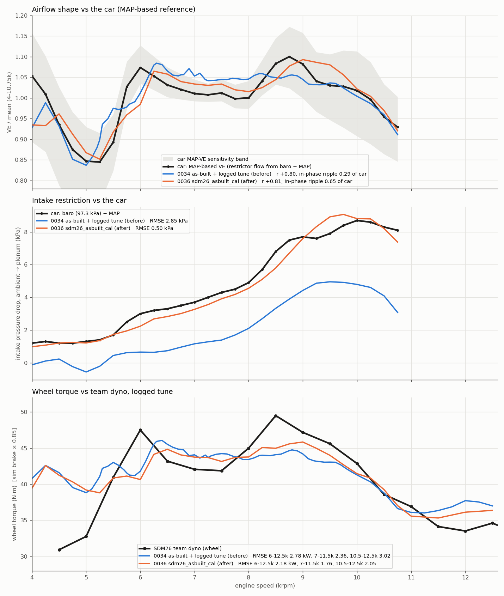

## TL;DR

- **New car reference.** Restrictor mass flow from (baro − MAP) is a tune-independent airflow measurement.
  - MAP-VE (`references/ecu/ve_map_reference.csv`, built by `scripts/mapve.py`) peaks at 6.0k and 8.75k, the same as the dyno. It correlates r 0.88 with dyno torque.
  - Its 7.5-8k dip is only −0.09 (sensitivity band −0.075 to −0.11).
  - PW·λ overstated the ripple ~2× and shifted it up in rpm, which also explains 0035's "dyno rpm axis" puzzle. **Retire PW·λ as the shape target.**
- **Three model errors found:**
  1. **Ambient** was sea level (101.3 kPa, 300 K). Tempe is ~97.3 kPa and ~305 K intake. This alone gave the biggest dyno gain.
  2. **Venturi diffuser recovery:** the model's intake Δp was about half the car's. `restrictor_diffuser_efficiency` 0.62 matches the car's baro − MAP curve over 4-10.75k within 0.5 kPa, including the ~1.2 kPa floor at 4-5k.
  3. **Exhaust wall temperatures** were 650/550/500 K. Realistic WOT header walls are 900/750/650 K. The cold walls pulled heat out of the blowdown pulses and damped the waves.
- **What sets the ripple amplitude:** exhaust blowdown strength (EVO, exhaust lift, exhaust Cd) and exhaust-pipe heat loss.
  - The model is numerically converged for amplitude: superbee, WENO5, CFL 0.3 and 2× cells all agree within ±0.05.
  - Friction is not the limiter, and intake valve area does nothing.
- **`sdm26_asbuilt_cal` (new experimental example config):**
  - It combines the as-built geometry, the logged tune (λ at the WOT-measured lag), the 0035 momentum collector and exhaust γ/R, and fixes 1-3.
  - It then has **level-only** calibration: combustion efficiency 0.98 and FMEP ×0.775. No wave knob was fitted.
  - Team-dyno RMSE is 2.18 kW over 6-12.5k, 1.76 over 7-11.5k and 2.05 over 10.5-12.5k (the logged-tune config was 2.78 / 2.36 / 3.02).

## 1. MAP-based airflow reference (experiment 1)

- **Method.** The mass flow through the 20 mm throat (Cd 0.97, T0 305 K) is computed from p0 = baro and plenum MAP, as compressible nozzle flow to the throat, with diffuser recovery η in `MAP = pt + η(p0 − pt)`. VE_map = ṁ / (ρ0·Vd·rpm/120), using the same WOT filter and 250 rpm bins as the proxies.
- **Baro is not logged.** 97.3 kPa is the Tempe standard. At 96.3 kPa the 4-5k absolute VE becomes implausible.
- **Sensitivity** (`references/ecu/ve_map_sensitivity.csv`): baro ±0.5-1 kPa, η 0-0.8, a Δp^n law with n 0.45-0.55, 50 ms MAP lag, 51 ms smoothing, and slow vs fast sweep halves. Depth is −0.075 to −0.108 in every case, and the peaks always sit at 6.0k and 8.5-8.75k.

| reference | ripple std 5.5-10k | 7.5-8k depth | peaks | r vs dyno torque |
|---|---|---|---|---|
| MAP-VE (base) | 0.044 | −0.089 | 6000 / 8750 | **0.88** |
| PW·λ, WOT lag (0035) | 0.087 | −0.254 | 6500 / 9000 | 0.53 |
| dyno torque / mean | 0.058 | −0.157 | 6000 / 8500 | - |

MAP falls monotonically through 7.25-8.25k (93.3 → 92.4 kPa). A 20 % airflow dip would need MAP about 1.5 kPa above trend, while the binned MAP std is 0.33 kPa. The PW·λ excess comes from the fuel side: closed-loop trim, the λ floor and transient fuelling.

## 2. Experiments (details, CSVs and figures in `experiments/`)

All experiments ran on sdm26_asbuilt_exhaust + momentum collector (M10) unless noted, over 28-32 rpm points at 30 cycles. "Slope" is the in-phase regression slope of model VE on car MAP-VE over 5.5-10k (1.0 would match the car's ripple). The M10 base has slope 0.49 and r 0.80.

- **Damping audit** (exp 2; new knobs `physics.pipe_friction_multiplier`, `pipe_heat_transfer_multiplier`, `exhaust_heat_transfer_multiplier`; default 1 = parity):

  | variant | ripple std | r / slope vs MAP-VE |
  |---|---|---|
  | base (M10) | 0.034 | 0.80 / 0.49 |
  | exhaust heat ×0 | 0.059 | 0.76 / 0.79 |
  | intake heat ×0 | 0.033 | 0.81 / 0.48 |
  | all heat ×2 | - | slope 0.18 |
  | friction ×0 | 0.028 | slope 0.36 |
  | friction ×2 | - | slope 0.53 |
  | superbee, WENO5, CFL 0.3, 2× cells | - | slope 0.45-0.48 |

  (`damping_audit.csv`)
- **Excitation** (exp 3; `ranking.csv`): slope change per plausible half-range.
  - EVO ±10°: 0.76 (earlier) to 0.22 (later).
  - Exhaust lift ±15 % and exhaust Cd ±20 %: 0.30 → 0.65.
  - Lift-shape exponent 1.0/1.6: 0.60 → 0.39.
  - IVC ±10°: 0.39 → 0.59.
  - Spark +5° reduces the slope by 0.06. Intake Cd and intake lift have no effect.
  - No input moves the peak or trough rpm. The strongest levers are the least-measured inputs.
- **Literature** (exp 4; `literature_brief.md`, some sources paywalled):
  - It confirms the WOT λ lag of about 90 ms against about 300 ms on overrun.
  - Its top amplitude suspects were numerical diffusion (ruled out by exp 2), restrictor wave absorption (no amplitude effect in the venturi family, exp 5) and unsteady valve Cd.
- **Intake restriction** (exp 5; `exp5_summary.csv`):
  - Ambient 97.3 kPa / 305 K takes dyno RMSE 6-12.5k from 3.46 to 2.54 kW, and 10.5-12.5k from 4.93 to 2.30.
  - Diffuser η 0.62 takes the intake-Δp RMSE from 2.74 to 0.44 kPa and gives the best MAP-VE r (0.82), but it lowers the level by 2.7 kW.
  - The legacy choked restrictor and η ≈ 0 grossly over-restrict.
  - The in-phase slope stays at 0.44-0.50 in all intake variants.
- **Exhaust wall temperature** (exp 6; `exp6_summary.csv`, on the exp 5 intake baseline):

  | walls / heat setting | slope | ripple std | de-biased RMSE |
  |---|---|---|---|
  | 650/550/500 K (base) | 0.47 | 0.033 | 2.10 |
  | 900/750/650 K | 0.71 | 0.050 | 1.92 |
  | 1000/850/750 K | 0.78 | 0.057 | - |
  | exhaust h ×0.3-0.5 | 0.66-0.68 | - | - |

  - The car's ripple std is 0.044.
  - Mean EGT stays at about 1200 K in every variant.
  - Realistic walls are the physical version of the heat multiplier, so no multiplier is used.

## 3. Level calibration (`scripts/`)

- **Base config** = logged-tune config + momentum collector + exhaust γ 1.30 / R 295 + ambient 97.3 kPa / 305 K + diffuser η 0.62 + walls 900/750/650 K.
- **λ map:** the logged-tune λ map was rebuilt at the WOT-measured lag (`references/ecu/proxy_wotA.csv`). The 270 ms map was shifted about 250 rpm where λ changes fastest (errors up to 0.08 λ). The corrected map left the fit unchanged.
- **Bend/muffler losses (0035) are left out.** They cut the slope from 0.62 to 0.55, and their K values are handbook guesses.
- **Method:** combustion efficiency sets the indicated level (two engine runs, at 0.94 and 0.98, interpolated). FMEP only enters post-cycle as brake = (IMEP − FMEP)·Vd/4π; the reconstruction matches the engine within 0.023 N·m. So an FMEP scale × η grid was fitted offline against dyno power over 6-12.5k (wheel = brake × 0.85).

| η_comb | best FMEP scale | RMSE 6-12.5k | bias |
|---|---|---|---|
| 0.94 (shipped) | 0.60 | 2.45 | −0.57 |
| 0.96 | 0.675-0.70 | 2.31 | −0.35 |
| **0.98 (chosen, physical ceiling)** | **0.775** | **2.19** | −0.31 |
| 1.00 (fit optimum, unphysical) | 0.875 | 2.07 | −0.27 |

- **The fit pins η_comb at its upper bound.** The residual pull comes from 8-9.5k, where the dyno's 8.5k torque peak (49.5 N·m wheel) is sharper than the model's (about 45). η is capped at 0.98.
- **FMEP ×0.775** gives 1.47 bar at 9k (was 1.90), which is plausible for a 600 cc four.
- **The drivetrain efficiency (0.85) is an assumption** and trades directly against this level.
- **Verification run of the committed config** (`run4.csv`; the repo config reproduces the verification run bit-for-bit at 9k):

| config | r / slope vs MAP-VE | intake Δp RMSE | dyno RMSE 6-12.5 | 6-8.5 | 7-11.5 | 10.5-12.5 | bias | dyno-T r |
|---|---|---|---|---|---|---|---|---|
| sdm26_asbuilt_realtune (0034) | 0.80 / 0.29 | 2.85 kPa | 2.78 | 2.77 | 2.36 | 3.02 | −0.10 | 0.65 |
| **sdm26_asbuilt_cal (0036)** | **0.81 / 0.65** | **0.50 kPa** | **2.18** | **2.57** | **1.76** | **2.05** | −0.29 | **0.71** |

## 4. What is still wrong

1. **Peaks are about 250 rpm late:** the model has 6.25k / 9.0k against the car's 6.0k / 8.75k. The broad 9-10k shoulder over-reads MAP-VE slightly.
2. **The dyno's torque peaks are sharper than the model's.** The model under-reads 6.0k by about 7 N·m and 8.25-9.5k by 2-5 N·m, and over-reads 6.5-7.5k by about 1.5 N·m. Part of this is the remaining amplitude gap (slope 0.65).
3. **Below 5.5k** the dyno is written off (the README calls it a pull-settle artefact), so it was not scored.
4. **The strongest remaining levers are unmeasured:** exhaust valve lift and Cd, and EVO at real lash. A flow-bench Cd/lift curve for the exhaust valve and a measured exhaust cam profile would do more than any further modelling. So would a baro logger channel or a key-on baro reading, and head port lengths.

## Model support added

- `physics.pipe_friction_multiplier`, `physics.pipe_heat_transfer_multiplier` and `physics.exhaust_heat_transfer_multiplier` (default 1.0; commits 515c4d78, afcce638). These are diagnostic knobs and are unused by the new config.
- `sdm26_asbuilt_cal.json` is registered in `cfd_list_examples`. It is in the warning-free/validation lists of engine-sim and cfd-core, and the desktop crate compiles (`cargo check`, 2026-09-29).
- `references/ecu/ve_map_reference.csv`, `ve_map_sensitivity.csv` and `scripts/mapve.py`.

## Reproducibility

- `scripts/gen.py` writes the configs. `make("x", losses=False, afr_wot=True, eta_comb=0.98, fmep_scale=0.775)` reproduces `sdm26_asbuilt_cal.json` except for its name and description.
- `run1.py`, `run3.py` and `run4.py` run the sweeps (`HUNTEXP` = the 0035 driver built on this branch). `levelfit.py` does the offline η × FMEP fit, and `fig36.py` draws the figure.
- `scripts/lib.py` is the 0035 scoring plus `analyze5` (MAP-VE, intake Δp, de-biased RMSE).
- `experiments/*` are the as-run scripts of the six experiments. They point at the session scratch directory and are kept as a record.
- All model rows are in `model_rows.csv`.
