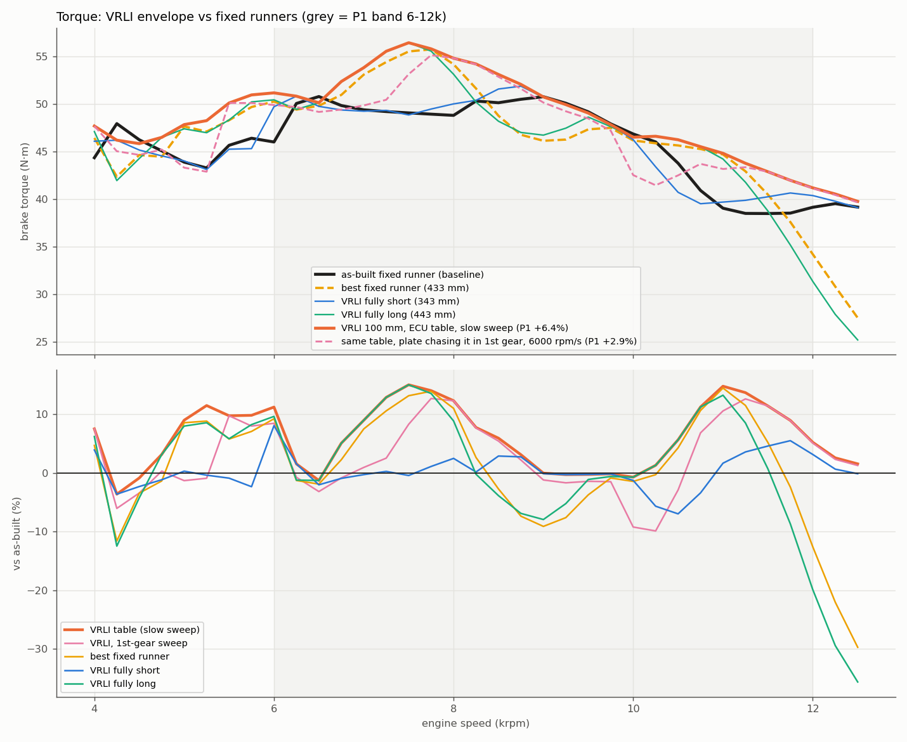
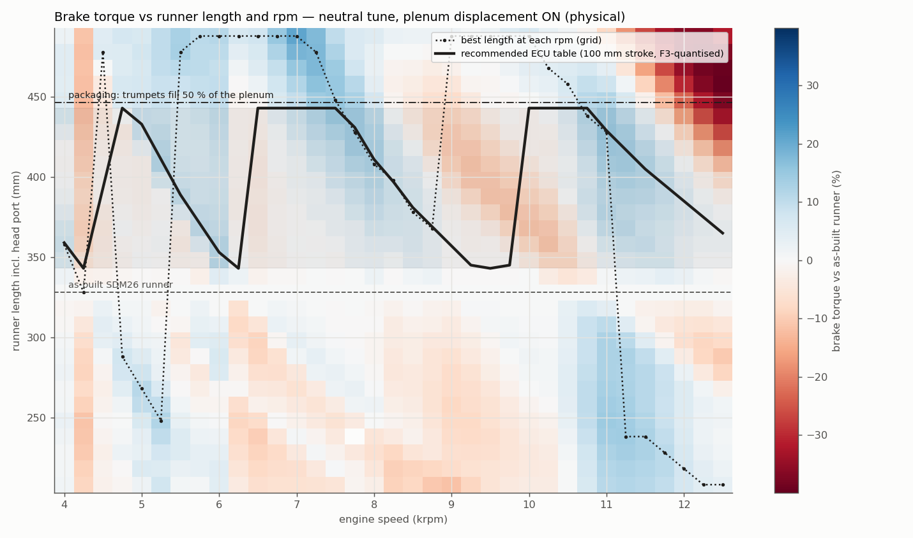
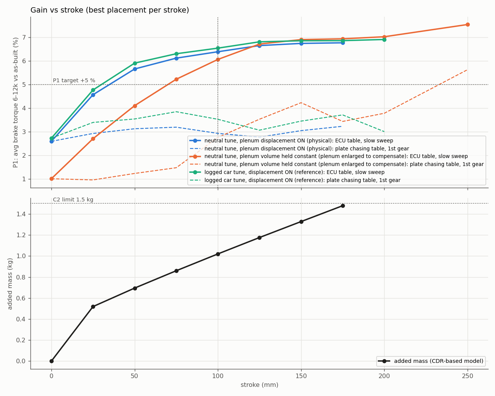

## TL;DR

The context is the VRLI Conceptual Design Review / Problem Definition (Google Drive). Requirements: P1 at least +5 % average brake torque over 6-12k vs the fixed SDM26 intake; P2 at least 0.97 of the better fixed end at every rpm; F2 full stroke in 0.5 s or less; C2 at most 1.5 kg added.

Study A: neutral tune, trumpets displace plenum volume, at most half the plenum. Runner lengths include the 80 mm head port.

| stroke | placement (runner mm) | P1: ECU table, slow sweep | dyno sweep 500 rpm/s | 3rd gear 1500 rpm/s | 2nd gear 3000 rpm/s | 1st gear 6000 rpm/s | P2 at 500 / 6000 rpm/s | mass |
|---|---|---|---|---|---|---|---|---|
| 0 (best fixed runner) | 433 | +2.6 % | +2.6 % | +2.6 % | +2.6 % | +2.6 % | 1.00 / 1.00 | 0 |
| 50 | 393-443 | +5.7 % | +5.7 % | +5.2 % | +4.3 % | +3.1 % | 1.00 / 0.90 | 0.69 kg |
| **100 (recommended)** | **343-443** | **+6.4 %** | **+6.4 %** | **+5.6 %** | **+4.2 %** | **+2.9 %** | **1.00 / 0.89** | **1.02 kg** |
| 150 | 293-443 | +6.7 % | +6.7 % | +5.9 % | +4.4 % | +3.0 % | 1.00 / 0.87 | 1.33 kg |
| 175 | 268-443 | +6.8 % | +6.8 % | +5.7 % | +4.8 % | +3.2 % | 1.00 / 0.87 | 1.48 kg |

- **Main result.** 100 mm meets P1 and P2 on the dyno, which is how both are tested. It adds +3.7 % over the best fixed runner.
- **Where the gain is.** It sits at 6.75-8.25k (+9 to +15 %) and 10.5-11.75k (+9 to +14.5 %), where the as-built runner is off-tune.
- **Fast sweeps are the weak point.** In 2nd/1st-gear sweeps the plate cannot follow the table's 100 mm jump between tuning orders near 9.5-10k, so P1 falls to +4.2 / +2.9 % and P2 to about 0.9 around 9-10.5k. The best achievable schedule at those rates (DP bound) is +5.3 / +4.7 %.
  - A gear- or rate-dependent table would recover most of that gap.
- **Diminishing returns.** Going from 100 to 150 mm adds only +0.35 %, which falls to the table's 2 mm quantisation level in 1st gear, for +0.3 kg.
- **The plenum and tune don't change the recommendation.**
  - With the plenum volume held constant (study B), the best design moves longer (408-508 mm) at a similar +6.1 %.
  - The car's logged tune (study C) gives the same design and +6.5 %.
- **Answering the CDR's 7k question.** 7k wants a runner of about 490 mm (+21 % at 7k), which is a length (packaging) limit, not a stroke limit. The 443 mm long end gives +9 % at 7k.



## 1. Tool: `helios-bench vrli`

```bash
helios-bench vrli physics_findings/0037-vrli-stroke-optimization/studies/A_neutral_disp.toml \
    --out physics_findings/0037-vrli-stroke-optimization/out/A_neutral_disp        # --analyze-only reuses the cache
```

- **Engine grid.** The tool runs the engine on an extension × rpm grid: −120..+200 mm in 10 mm steps × 4000-12500 in 250 rpm steps. Extension is added at the plenum mouth.
  - Each point is the mean of the last 5 of 30 cycles.
  - Points are cached (NDJSON), so studies resume and re-score without re-running the engine.
- **Convergence gate.** A point whose VE varies by more than 2 % over its last 6 cycles is flagged. Designs are confined to the contiguous converged range around the baseline.
- **Per-stroke optimisation.** For every stroke (the design variable, 0-300 mm) it tries every placement in 5 mm steps and keeps the one with the best P1. Each design gets:
  - **the ECU table:** the per-rpm optimum inside the stroke, found on a 1 mm grid with Catmull-Rom interpolation in length, then quantised to F3's 2 mm;
  - **follow:** the plate chasing that table at stroke / 0.5 s (F2) during an up-sweep at `sweep_rate_rpm_s`;
  - **DP bound:** the best schedule any table could achieve at that rate;
  - **P2** at the chosen sweep rate;
  - **the fail-safe length:** the best single fixed position inside the stroke;
  - **the required vs available actuator speed**, and the **mass** from a model based on the CDR breakdown (fixed 0.30 kg + 0.42 kg per 100 mm + actuator 0.30 kg × (S/100)^0.7, giving 1.02 kg at 100 mm);
  - **packaging:** protrusion into the plenum, capped where the trumpets would fill half the plenum.
- **Outputs.** `surface.csv`, `designs.csv` (every placement), `strokes.csv` (the Pareto set), `recommended.json` (best feasible design plus the knee: the smallest stroke reaching 90 % of the best variable-length increment over the best fixed runner) and `ecu_map.csv` (rpm → runner length / plate position, plus every torque curve).

**Engine support (opt-in; `default()` and every shipped config bit-identical, parity suite green):**
- `physics.runner_mouth_extension`: a constant-diameter section at the mouth. Negative values trim the mouth end. The port/taper end is unchanged, the end correction moves to the new mouth, and the cell count scales with length.
- `physics.vrli_trumpet_od` / `vrli_displacement_ref`: protrusion beyond the reference removes n·(π/4)·OD²·(ext − ref) from the plenum. Shorter runners give nothing back, because the envelope is fixed (C3).
- `SDM26Config::resolve_vrli()` is idempotent, and the overrides are also in cfd-core.
- Tests:
  - engine-sim: `vrli_defaults_are_a_no_op`, `vrli_mouth_extension_prepends_a_mouth_section_and_trims`, `vrli_trumpets_displace_plenum_volume`;
  - helios-bench: 8 synthetic-surface tests covering interpolation, trapezoid band weights, the envelope tracking a 1/rpm tuned length, monotonic gain vs stroke, the rate limit binding, follow-table, the mass model and the knee.

## 2. First run: a non-periodic corner (why the gate exists)

- **What went wrong.** The first study read the last cycle only, and it reported +28 % at a best fixed runner of 523 mm, at the grid edge.
- **Cause.** At +190/+200 mm, 44 mm trumpets displace 1.2 L of the 1.44 L plenum (clamped at 20 %). With 0.29 L left the engine never becomes periodic: there is a ~12-cycle limit cycle with VE swinging 1.13-1.36.
- **Fix.** Metrics are now cycle-averaged and non-periodic points are excluded. The packaging rule (trumpets fill at most half the plenum, a 118 mm protrusion) keeps designs well clear of that corner.
- **After the fix.** Only 1 of 1015 points is flagged (at −90 mm), so the design range is −80..+160 in study A.

## 3. Results

| study | stroke | placement (runner mm) | P1 table | P1 1st gear (DP bound) | vs best fixed | driver 7-10.5k | fail-safe |
|---|---|---|---|---|---|---|---|
| A neutral, displacement (physical) | 0 | 433 | +2.6 % | +2.6 % | - | +1.6 % | - |
| A | 100 | 343-443 | +6.4 % | +2.9 % (+4.7 %) | +3.7 % | +5.6 % | 432 mm (+2.6 %) |
| B neutral, constant plenum | 0 | 413 | +1.0 % | +1.0 % | - | −0.3 % | - |
| B | 100 | 408-508 | +6.1 % | +2.8 % (+4.0 %) | +5.0 % | +4.3 % | 413 mm (+1.0 %) |
| B | 125 | 403-528 (grid edge) | +6.7 % | +3.5 % (+4.7 %) | +5.7 % | +4.7 % | 413 mm |
| C logged tune, displacement (500 rpm grid) | 100 | 343-443 | +6.5 % | +3.5 % (+5.1 %) | +3.7 % | +5.8 % | 431 mm (+2.7 %) |

- **The optimum per rpm (study A).** From 6 to 8.5k it wants long runners, falling 488 → 378 mm (runner × rpm ≈ constant). At 10-11k the next order takes over at 490-430 mm, and at 11.5-12k a short family appears (about 220-240 mm).
- **The recommended table.** It follows long → short over 6.5-9.5k, jumps back long at 10k, and goes long → short again to 12.5k.
  - Required plate speed at a 1st-gear sweep: 2400 mm/s for the jump, against 200 mm/s available (F2).
  - At a 500 rpm/s dyno sweep the requirement is exactly 200 mm/s.
- **Plenum-volume confound.** Letting the trumpets shrink the plenum (A) adds 1-3 N·m at nearly every rpm at +100-150 mm, compared with holding the volume (B). Part of A's advantage is therefore a smaller-plenum effect, not runner length, and a fixed runner with a smaller plenum would share it. B is the cleaner runner-length number: +6.1 % at 100 mm, of which +5.0 % is over its best fixed runner.
- **The tune.** C (the car's logged λ/spark, 500 rpm grid) reproduces A's design and gains. The recommendation is not sensitive to the tune.

Figures: `fig_envelope.png` (torque with the table and 1st-gear following), `fig_surface.png` (torque vs length × rpm, with the per-rpm optimum, the ECU table and the packaging line) and `fig_pareto.png` (gain vs stroke for A/B/C with the mass model).




**Recommended design, study A.**
- Stroke: 100 mm.
- Retracted runner 343 mm, extended 443 mm, i.e. extension +15..+115 mm over the as-built 328 mm.
- Fail-safe spring position: 432 mm (plate at about 89 mm). As a fixed runner it is worth +2.6 %.
- ECU table (`out/A_neutral_disp/ecu_map.csv`, plate position 0 = retracted):

| rpm | 6000 | 6500 | 7000 | 7500 | 8000 | 8500 | 9000 | 9500 | 10000 | 10500 | 11000 | 11500 | 12000 | 12500 |
|---|---|---|---|---|---|---|---|---|---|---|---|---|---|---|
| runner (mm) | 353 | 443 | 443 | 443 | 411 | 381 | 357 | 343 | 443 | 443 | 429 | 405 | 385 | 365 |
| plate (mm) | 10 | 100 | 100 | 100 | 68 | 38 | 14 | 0 | 100 | 100 | 86 | 62 | 42 | 22 |

## 4. Caveats (read before cutting hardware)

1. **Placement likely about 4 % long for the real car.** 0036 shows the model's tuning peaks sit about 250 rpm (about 4 %) late vs the car. With L ∝ 1/rpm, the car needs runners about 4 % shorter for the same peak, e.g. about 330-425 mm instead of 343-443. The stroke answer is unaffected.
2. **Gains are probably under-predicted.** The model carries about 0.62 of the car's in-phase ripple (0036), so absolute tuning gains are likely under-predicted. The relative ranking (stroke, placement) is the trustworthy part.
   - The chief engineer's "4-8 % is realistic, above 10 % is a model error" brackets the 6.4-6.8 % here.
3. **Plenum and packaging are assumed.** The as-built plenum is a 120 mm-tall 1.44 L bell and cannot host 115 mm of trumpet travel. The study assumes a VRLI plenum of the same 1.44 L volume (the CDR concept is about 350 mm long).
   - Whether the trumpets shrink it (A) or it is enlarged to compensate (B) changes the best placement by about 65 mm. Settle the plenum CAD first, then re-run with its real volume and `vrli_trumpet_od`.
   - The carrier plate, rods and actuator also occupy plenum volume. That is not modelled.
4. **Sweep-rate transients are quasi-steady.** They are modelled as a sequence of steady engine states (the 1D engine runs are steady-speed). The effect of runner motion on the gas dynamics within a cycle is not modelled.
5. **Mass is an extrapolation.** The mass model extrapolates the CDR estimate. Weigh prototypes, per C2.
6. **Next.** A gear- or rate-dependent table (the Link G4X can switch tables by gear), or a hysteresis rule for the 9.5-10k order switch, is the controls lever for the 1st/2nd-gear shortfall. The tool's DP output (`dp_extension_mm`) gives the rate-optimal table to start from.

## Reproducibility

- `run_all.sh` runs studies A/B/C in about 2.5 h on 15 threads. The cache `vrli_cache.ndjson` is committed, so `--analyze-only` reproduces every table in seconds.
- `studies/A_sens_*.toml` are the sweep-rate / actuator-speed sensitivities.
- `plot.py` writes the figures and `summary.csv`.
- The driver of record is `helios-bench` at this commit.
