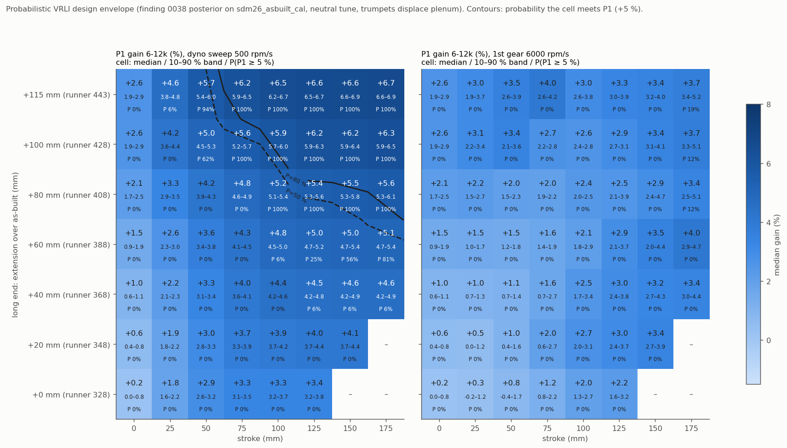

## TL;DR

**Phase 1: model bands vs the car.**
- 65 samples (sample 0 = the unperturbed `sdm26_asbuilt_cal`, then 64 LHS draws) × 32 rpm, 30 cycles.
- The Gaussian likelihood covers normalised MAP-VE 4-10.75k (σ 0.036), the car intake Δp (σ 0.5 kPa) and dyno wheel power 6-12.5k (σ 2 kW). Drivetrain η is profiled per sample, as in 0036 §5.
- The raw likelihood is sharp (ESS 1.2), so it is tempered at T = 10.3 to reach ESS 10.
- **The bands only partly cover the car** (`fig_bands.png`).
  - Intake Δp is inside the 80 % band over most of 4.5-10.75k.
  - MAP-VE is inside at the peaks and the top end, but not through the car's 6.75-8k dip or the 9.25-9.5k fall-off.
  - The dyno is outside the 95 % torque band at most speeds: the 6k and 8.5k peaks are under-read and the 6.5-7.5k dip over-read.
  - The input uncertainty widens the ripple, but no plausible input set reproduces the car's full dip.
- **The in-phase ripple slope is 0.65 at the median, with an 80 % range of 0.36-1.02 (prior 0.12-0.98).** The car's amplitude (slope 1) is at the top of the band, not outside it, so the 0036 "~0.62 of the car" is inside the input uncertainty.
- The best-weighted sample (30, weight 0.22) is written as a candidate config, not a calibration (`out/best_sample_config.json`). It has exhaust lift ×1.10, primary walls about 1035 K, intake port +10 mm, diffuser η 0.60 and baro 97.1 kPa. Its scores are r_VE 0.91 (0036: 0.82), slope 0.73, dyno RMSE 1.95 kW and intake-Δp RMSE 0.51 kPa.
- **The data constrain:** diffuser η (post/prior sd 0.55), baro (0.56), intake port (0.53, shifted +8 mm), exhaust port (0.64), EVO (0.76) and intake lift (0.78).
- **Barely or not constrained:** exhaust lift (1.02), IVC (1.07), wall temperature (0.95) and the Cd multipliers (0.84-0.88). These need measurement; see §4.

**Phase 2: a probabilistic VRLI design envelope.**
- The 11 unique posterior samples (16 systematic resamples) are each run on a VRLI surface: extension −140..+120 mm at 20 mm × 6000-12500 rpm at 500 rpm, with the neutral tune and 44 mm trumpets displacing the plenum.
- Each surface is scored with `helios-bench vrli` at four sweep rates. Each (cap, stroke) cell takes the 0037 rule: the best placement with lmax ≤ cap.
- **Robust ranking.** The optimal placement is the same in every posterior sample (lmax at the cap), and the 10-90 % band of the gain is about ±0.3 %. The uncertainty that matters for VRLI is not the model inputs but **how fast the engine sweeps**.

| cell (long-end cap, stroke) | dyno 500 rpm/s: median [10-90 %], P(P1 ≥ 5 %) | 2nd gear 3000 rpm/s | 1st gear 6000 rpm/s |
|---|---|---|---|
| +0 mm, 100 mm (shorten only) | +3.3 [3.2-3.7] %, P 0 | +2.9 %, P 0 | +2.0 %, P 0 |
| +40 mm, 100 mm | +4.4 [4.2-4.6], P 0 | +3.2, P 0 | +2.5, P 0 |
| +60 mm, 150 mm | +5.0 [4.7-5.4], P 0.56 | +4.5, P 0.19 | +3.5, P 0 |
| +80 mm, 100 mm | +5.2 [5.1-5.4], **P 1.00** | +3.7, P 0 | +2.4, P 0 |
| +100 mm, 75 mm | +5.6 [5.2-5.7], **P 1.00** | +4.0, P 0 | +2.7, P 0 |
| +115 mm, 50 mm | +5.7 [5.4-6.0], P 0.94 | +4.8, P 0.38 | +3.5, P 0 |
| **+115 mm, 100 mm (0037 recommendation)** | **+6.5 [6.2-6.7], P 1.00; P(P2 ≥ 0.97) 1.00** | +4.6 [4.1-4.9], P 0.06 | +3.0 [2.6-3.8], P 0 |
| +115 mm, 175 mm | +6.7 [6.6-6.9], P 1.00 | +5.3 [4.8-6.0], P 0.81 | +3.7 [3.4-5.2], P 0.19 |

- The quasi-steady table and the 500 rpm/s dyno sweep agree within 0.1 % everywhere. The 100 mm / 0.5 s actuator keeps up at dyno rates.
- **In a fast sweep the table cannot be followed.** The posterior-median ECU table for the 0037 design (`fig_vrli_rates_ecu.png`, right) goes to the long end at 6.5-7.5k, sweeps to the short end by 9.5k, then jumps back to the long end at 10k. Each jump is a full stroke. At 6000 rpm/s a 500 rpm step lasts 83 ms, and a 200 mm/s actuator moves 17 mm in that time.
  - This is why the 1st-gear gains collapse to about half, and why P2 fails in every sample at 3000 and 6000 rpm/s.
  - The F2 requirement (0.5 s full stroke) is sized for the dyno, not for 1st and 2nd gear.

## 1. Tool: `helios-bench ensemble`

- **What it does:** it samples per-parameter priors and applies each sample to one base config through `cfd_core::params::apply_override`. It runs every (sample, rpm) point in parallel and writes resumable NDJSON. Sample 0 is the unperturbed base.
  - Priors: uniform, log-uniform or normal (clipped); absolute, delta or scale about the base value (from the cfd-core schema); `also = [...]` links several paths to one draw.
  - Sampling: Latin hypercube by default, seeded.
  - NDJSON contents: the prior draw, the applied override values, VE, IMEP, brake torque/power, FMEP, mean plenum static pressure and EGT.
  - It uses the 0033 `huntexp` driver conventions (30 cycles, observer over the last 3).
- **Split with Python:** the likelihood, tempering and bands live in `scripts/analyze.py`.
  - The car references are study choices: MAP-VE is recomputed per sample because baro is a prior, the dyno is a CSV, and the error model is a judgement.
  - The runner stays generic, and new studies need only a TOML.
- **New opt-in engine-sim knobs (default = parity):**
  - `intake_cd_multiplier` and `exhaust_cd_multiplier` scale the valve Cd tables.
  - `intake_port_length_delta` and `exhaust_port_length_delta` change the length of the head-port segment only: the last diameter-profile segment of each runner (the valve end) and the first of each primary. The rest of the geometry is kept.
  - All four are config keys (`physics.*`) and cfd-core overrides.
- **Tests:**
  - sampler stratification and seeding, normal-quantile accuracy, override modes and linked paths;
  - the new knobs reaching the engine (Cd tables scaled; runner and primary lengths changed by exactly the delta; runner mouth unchanged);
  - zero perturbation bit-identical.
  - Full engine-sim / cfd-core / helios-bench suites are green (62 binaries), including after the VRLI merge.
- **Check against 0036:** sample 0 reproduces 0036 exactly: 9000 rpm VE 1.00137, brake torque 49.561 N·m, dyno RMSE 2.007 kW, intake-Δp RMSE 0.491 kPa, slope 0.615.

## 2. Priors (phase 1, `studies/phase1.toml`)

| parameter | prior | reason |
|---|---|---|
| exhaust valve open | 0036 value ±8° | a 1 mm-lift service-manual event; real lash / cam wear; 0036 exp 3 made it the top ripple lever |
| exhaust valve close | ±5° | same source, less influence |
| intake valve close | ±5° | same |
| exhaust / intake max lift | ×0.9-1.1 | marked unverified in the config |
| exhaust Cd | ×0.85-1.2 | generic steady-bench table; pulsating-flow Cd can run higher (0036 literature brief) |
| intake Cd | ×0.9-1.1 | intake Cd had no amplitude effect (0036 exp 3), so a narrower range |
| exhaust head port | 65 mm ±25 (40-90 mm) | 0034 estimate |
| intake head port | 80 mm ±30 (50-110 mm) | 0033: the owner cannot measure it |
| primary wall T | 900 ±150 K (750-1050), secondary / collector keep −150 / −250 K | 0036 exp 6: realistic WOT header range |
| diffuser η | 0.62 −0.12 / +0.13 (0.50-0.75) | 0036 exp 5 matched the car's Δp at 0.62 |
| baro | 97.3 ±0.5 kPa | not logged; it also moves the MAP-VE reference and the car intake Δp (recomputed per sample) |

- **Level:** combustion efficiency and FMEP are not sampled. Wheel power = η_dt·brake, with η_dt fitted per sample in closed form and bounded to 0.85-0.98 (0036 §5). The posterior η_dt is 0.938 ± 0.02.
- **Grid:** 4000-10750 rpm in 250 rpm steps plus 11000-12500 in 500 rpm steps (32 points), at 30 cycles. That is 2080 points; no errors, and all converged.

## 3. Phase 1 results (`out/`)

- **Likelihood and tempering.** The untempered posterior puts almost all weight on one sample (ESS 1.2). That means the error model is tighter than the model's real structural error. It is tempered to ESS 10 (T = 10.3), which is equivalent to inflating every σ by about 3.2×.
  - So these are **plausibility bands, not calibrated confidence intervals.** With 65 samples in a 12-D prior, the posterior is resolved only coarsely.
- **Parameter posteriors** (`out/param_posterior.csv`, `fig_params.png`), posterior/prior sd:
  - intake port 0.53 (median +8 mm, i.e. about 88 mm);
  - diffuser η 0.55 (median −0.017, i.e. 0.60);
  - baro 0.56 (median −25 Pa);
  - exhaust port 0.64;
  - EVO 0.76;
  - intake lift 0.78;
  - intake / exhaust Cd 0.84 / 0.88;
  - exhaust close 0.86;
  - wall T 0.95;
  - exhaust lift 1.02;
  - IVC 1.07.
  - The intake-side geometry and the restriction are what the car data pin down. The exhaust-side amplitude levers stay open: lift, wall temperature, and Cd only partly.
- **Bands** (`out/bands.csv`, `fig_bands.png`), checked point by point:
  - **MAP-VE.** Inside the 80 % band at 5.0-5.5k, 6.25-6.5k, 8.25-9.0k and 10-10.75k; within the 95 % band at 6.0k and 9.75k.
    - It is **outside the 95 % band at 6.75-8.0k**. The car sits at 1.00-1.02 normalised, the band at 1.02-1.04, so the model's mid-band plateau is still too high.
    - It is also outside at 9.25-9.5k, where the car falls off faster after the 8.75k peak, and at 4.0-4.25k, 4.75k and 5.75k (the sub-6k region, 0036).
  - **Intake Δp.** Inside the 80 % band at 4.5-5.5k, 7.0-9.0k and 9.75-10.75k. Outside at 5.75-6.0k, where the car is 0.5-0.7 kPa higher, and at 9.5k.
  - **Dyno wheel torque.** The band is narrow (±1-2 N·m), and the dyno is outside the 95 % band at most speeds.
    - Under-read: 6.0k by 1.2 N·m, 8.5k by 1.5 N·m, 9-10k by 0.2-0.8 N·m.
    - Over-read: the 6.5-7.5k dip, by 0.4-1.2 N·m.
  - So the prior widens the ripple, but no plausible combination of these twelve inputs reproduces the car's full 6k / 7.5k / 8.5k peak-dip-peak. The remaining gap is structural (the 0036 missing amplitude, peaks about 250 rpm late), not a matter of these inputs.
- **Which samples win.** The weight is concentrated on 0 and 30. Sample 30 has more exhaust lift, hotter walls and a longer intake port: a stronger, better-preserved blowdown pulse, which is the 0036 amplitude mechanism. The model's ripple deficit is not forced by the inputs.

## 4. Measurements that would narrow the posterior most

These are, from the phase-1 sd ratios and the 0036 lever ranking:

1. **Exhaust valve lift and cam profile** (dial indicator + degree wheel at running lash). It is unconstrained by the car data (sd ratio 1.02), and it is the second-strongest ripple lever.
2. **Header wall temperatures at WOT** (thermocouple or IR). Unconstrained (0.95), and the amplitude lever from 0036 exp 6.
3. **Exhaust port flow bench (Cd vs lift).** Only weakly constrained (0.88).
4. **Baro at test time.** Cheap. Its posterior sd is 159 Pa, but it moves the reference itself.

## 5. Phase 2: VRLI propagation (`out/phase2/`)

- **Setup.** Systematic resampling of 16 draws gives 11 unique samples: 0 (×3), 30 (×4), and 5, 15, 16, 26, 40, 42, 46, 54, 57 (×1 each).
  - Each sample runs the 0037 `A_neutral_disp` study on a coarser grid: extension −140..+120 mm at 20 mm (runner 188-448 mm) × 6000-12500 rpm at 500 rpm, 30 cycles.
  - The sample's applied values are passed as `[vrli.overrides]` on the same base config, with the neutral tune (no logged afr/spark maps), a 44 mm trumpet OD displacing the plenum above the as-built mouth, and the 0037 design block.
  - The packaging limit is the tool's plenum-fraction rule: the trumpets may displace at most half the plenum, which gives about 118 mm maximum protrusion.
  - That is 11 × 196 = 2156 points, all converged.
- **Sweep rates.** The surface was analysed at four rates with `--analyze-only` (one engine run per sample):
  - the quasi-steady table (1 rpm/s);
  - the dyno sweep (500 rpm/s);
  - 2nd gear (3000 rpm/s);
  - 1st gear (6000 rpm/s).
  - At each rate the tool follows the quantised quasi-steady table with a 200 mm/s actuator (100 mm in 0.5 s, F2).
  - The envelope cell uses the 0037 rule (placement maximising the quasi-steady P1, subject to lmax ≤ cap) and reports that design's gain at each rate.
  - Cross-check: applied to 0037's own `A_neutral_disp` designs, this rule reproduces the 0037 deterministic `envelope.csv` in all 43 cells to 0.001 %.
- **The envelope** (`out/phase2/envelope_distribution.csv`, `fig_envelope_uq.png`):
  - At the dyno sweep, P(P1 ≥ 5 %) is at least 0.8 when the long end may grow **by ≥ 80 mm with a ≥ 100 mm stroke**, **by ≥ 100 mm with ≥ 75 mm**, or **by 115 mm with ≥ 50 mm** (0.94).
  - With a **shorten-only** design (cap 0) the best is +3.3-3.4 % at 100-125 mm of stroke, and P1 is never met.
  - A +60 mm long end needs 150-175 mm of stroke for P ≥ 0.56-0.81.
  - Medians are within 0.1-0.3 % of the deterministic 0037 envelope (sdm26_asbuilt_cal, finer grid).
- **The optimal placement never changes across the posterior.** In every cell the 10-90 % range of lmin is a single value, with lmax at the cap. The design recommendation is robust to the uncertain inputs. Only the size of the gain moves, and by about ±0.3 %.
- **0037 recommendation** (100 mm at +15..+115, runner 343-443 mm):

| sweep rate | P1 gain median [10-90 %] | P(P1 ≥ 5 %) | P(P2 ≥ 0.97) |
|---|---|---|---|
| table / dyno 500 rpm/s | +6.5 [6.2-6.7] % | 1.00 | 1.00 |
| 2nd gear 3000 rpm/s | +4.6 [4.1-4.9] % | 0.06 | 0.00 |
| 1st gear 6000 rpm/s | +3.0 [2.6-3.8] % | 0.00 | 0.00 |

  - The best fixed (fail-safe) position within that stroke is 79-115 mm across samples, and gives +1.5-3.3 %. The 0037 value (104 mm, i.e. 432 mm) sits in the middle.
- **The ECU table band** (`out/phase2/ecu_table_per_sample.csv`, `fig_vrli_rates_ecu.png`) is the same shape in every sample, with a spread of up to ±10-20 mm at the transitions:
  - 6.0k: short;
  - 6.5-7.5k: long;
  - 8-9.5k: ramps short (343 mm by 9.5k);
  - 10-10.5k: long again;
  - 11-12.5k: ramps back short.
- **Consequence.** The table asks for two full-stroke reversals inside the band. The design question is no longer model uncertainty but actuator speed and control strategy.
  - Options: an actuator of about 1 m/s (100 mm in about 0.1 s), a feed-forward move ahead of the rpm, or a table restricted to one monotonic branch (trading the 10k long-runner peak for followability).
  - `helios-bench vrli` can score each option by editing `full_stroke_time_s` or the table.

## 6. Caveats

- **Bands, not calibrated intervals.** The posterior is tempered (T = 10.3, ESS 10) and resolved by 65 samples. Phase 2 uses 11 unique samples, and its bands are about ±0.3 % wide, which is smaller than the model's structural error.
- **What the posterior does not include:** 0036 found the model's peaks sit about 250 rpm late relative to the car. That structural error is not in the posterior, so absolute gains and the ECU table's rpm placement should be read with it.
- **Tune.** Phase 2 uses the neutral tune. The logged tune (0037 study C) changes the level of gains but not the ranking.
- **Packaging** is the tool's plenum-fraction limit (about 118 mm). Check it against CAD.

## Reproducibility

- **Phase 1:**
  1. `helios-bench ensemble physics_findings/0038-uq-ensemble/studies/phase1.toml --out physics_findings/0038-uq-ensemble/out/phase1.ndjson`. It is resumable, and `run_phase1.sh` gates it on a free CPU.
  2. `scripts/analyze.py` → `out/samples_scored.csv`, `param_posterior.csv`, `bands.csv` and `summary.json`. This needs `references/ecu/scripts/log.pkl`, which is built by `load.py` from the vault log.
  3. `scripts/plot.py` draws the figures.
  4. `scripts/sample_config.py` writes the best-sample config.
  - `out/phase1_points.csv` holds every engine point. The raw NDJSON is gitignored.
- **Phase 2:** `scripts/phase2.py prepare|run|collect`, then `scripts/plot2.py`. `run_chain.sh` runs the whole chain.
  - Per-sample study TOMLs and `vrli` outputs are in `out/phase2/s*/`. The engine caches are gitignored.
